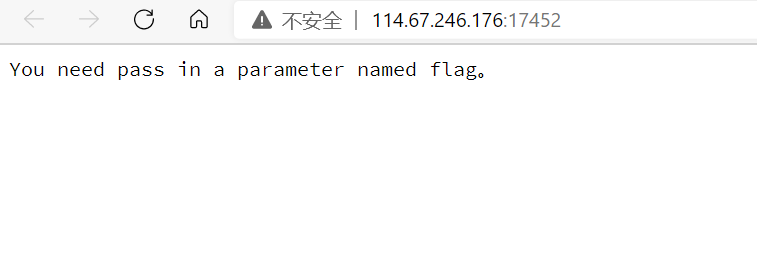
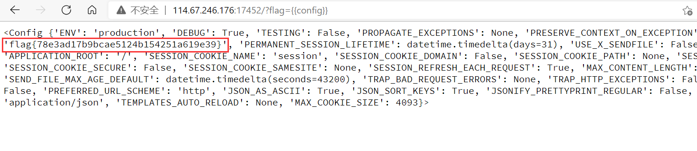

# Simple_SSTI_1

**SSTI(Server-Side Template Injection)服务端模板注入**

You need pass in a parameter named flag.

> 你需要传入一个名为flag的参数

模板注入

直接查看配置信息

payload

> `http://114.67.246.176:17452/?flag={{config}}`

得到flag

