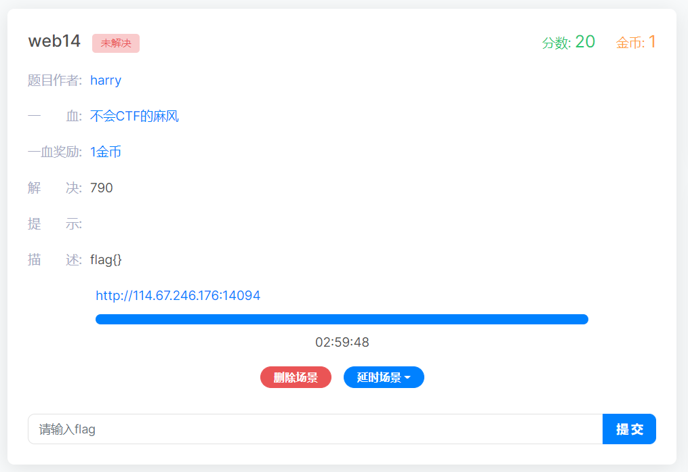
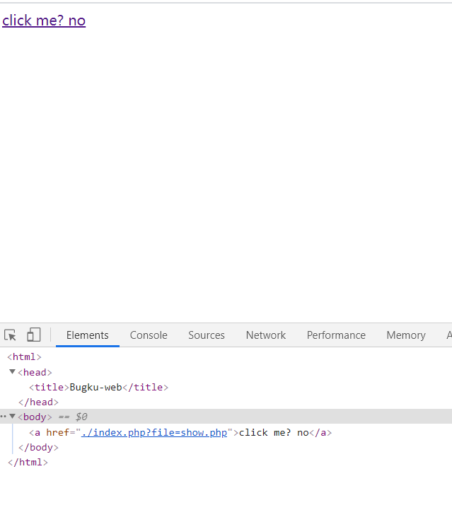
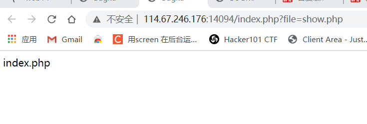
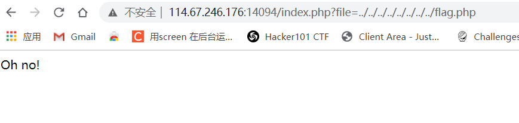
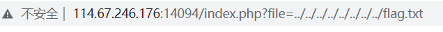
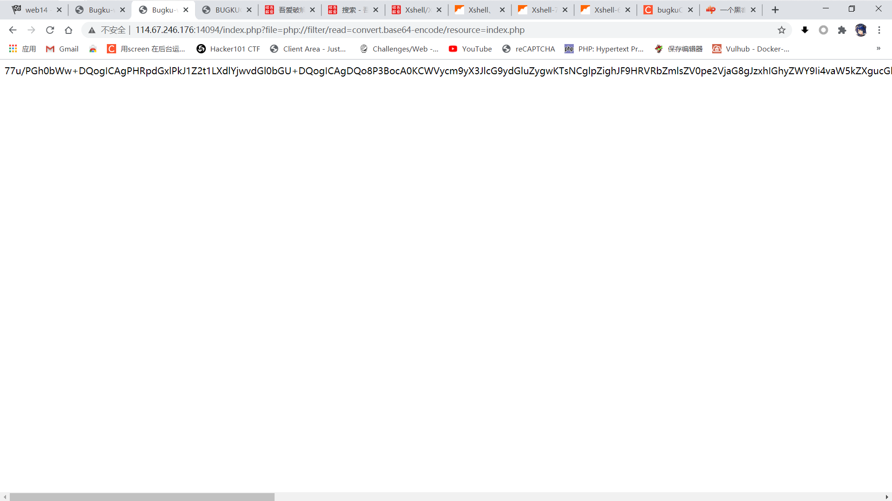
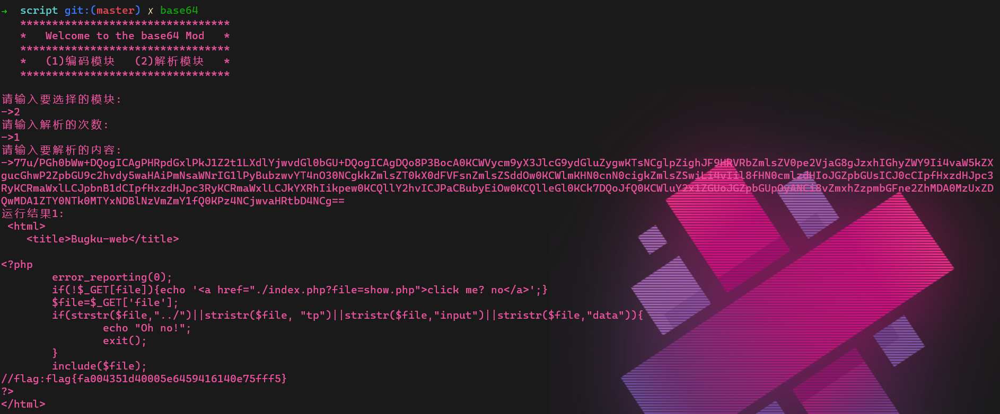

# web14



进入环境


只有一个超链接



查看源码发现连接的地址是一个show.php的文件

点击看看



emmmm

只有回显index.php的字样

看url有点像文件包含

尝试看看根目录有没有flag.php的文件



回显一个oh no

emmm



flag.txt也显示同样的字样

那可以确定只要是越过目录就会这样

emmmmm

看看能不能执行php的伪协议来查看源码


 ```php
php://filter/read=convert.base64-encode/resource=index.php
 ```

这一句伪协议可以以base64编码的形式回显指定的文件源码



得到源码

进行解码



得到flag


