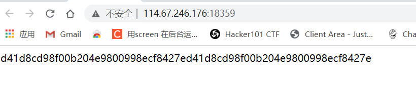
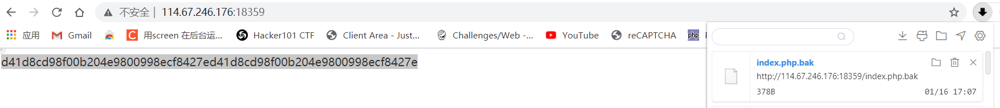
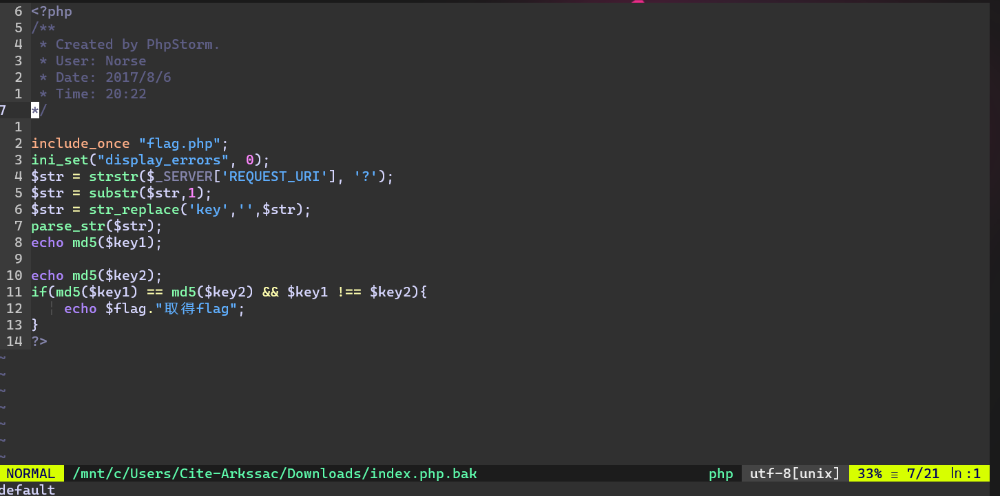
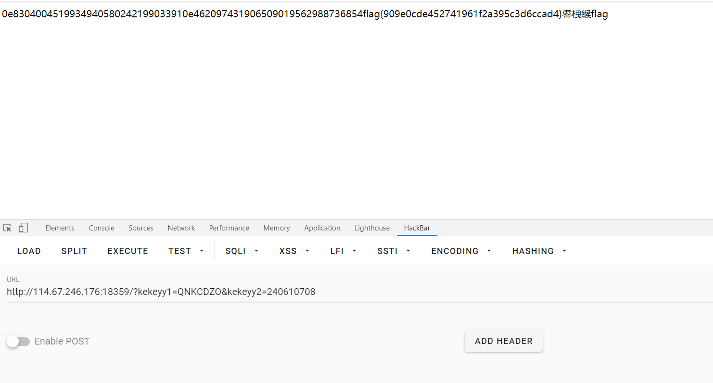
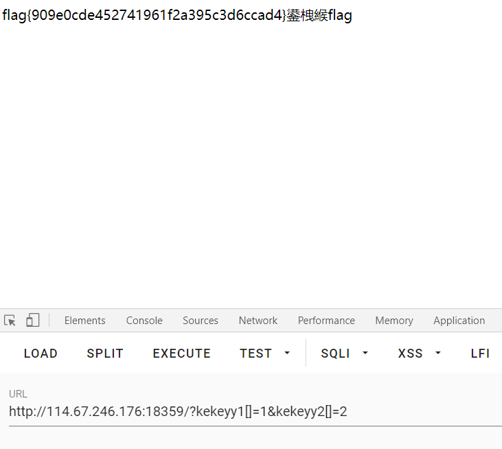

# web16


题目描述

> 备份是个好东西

进入环境



只有一些哈希值

看看有没有主页的备份



下载到主页备份源码

查看源码



```php
<?php
include_once "flag.php";
ini_set("display_errors", 0);
$str = strstr($_SERVER['REQUEST_URL'], '?');
$str = substr($str, 1);
$str = str_replace('key', '', $str);
parse_str($str);
echo md5($key1);

echo md5($key2);
if(md5($key1) == md5($key2) && $key1 !== $key2){
    echo $flag."取得flag";
}
?>	
```

代码大致意思是

包含flag.php文件

预设报错为0

strstr 函数来检查接收参数的位置

substr返回$str的第第二个字符串

str_repleace替换$str中的key值

正则匹配$str

打印$key1的md5值

打印$key2的md5值

如果\$key1的md5值不等于\$key2的md5值和\$key1 不等于$key2

就打印flag

emmmm

这个代码有点绕

重点就是要请求key1和key2

但是str_replace过滤了key这三个字母

这个str_replace只执行一次就是，可以使用重合的方式来进行请求

就是kekeyy1和kekeyy2

这样它把key给过滤掉了剩下的字符串就会组合成key了

然后要key1的md5值和key2的md5值相等但是又让key1和key2不相等

过关方法1：

php中有一个md5的对比漏洞

php是弱类型语言

==进行对比的时候只判断两个参数的值，而不判断参数的类型

```php
<?php
$str = md5('QNKCDZO');
var_dump($str == '0');
```

这个段代码打印出来的是bool(true)

只要是0e开头的md5值互相对比都会出现这种情况



过关方法2：

在php中利用md5值无法加密数组的特性

进行绕过

> 注：
>
> ​	在php中md5函数加密数组会返回一个NULL的值

