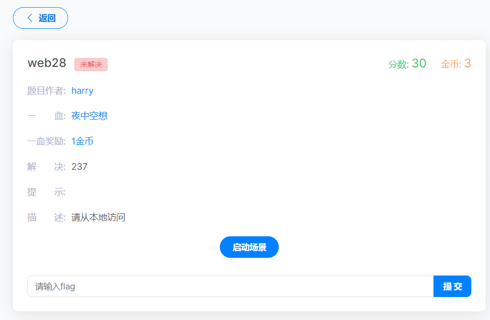
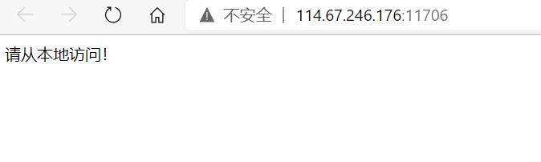

# web28

题目描述

请从本地访问

进入题目

请从本地访问

在这里说一下

referer和X-Forwarded-For的区别

> referer是用来记录当前请求页面的来源地址的，服务器通过referer来确认访问来源的，
>
> 通俗易懂的说，是确认从浏览器的哪个页面发送过来的请求，就是确认来源浏览器的
>
> X-Fowarded-For是服务器用来确认发送请求客户端的真实ip地址的(可伪造)，包括代理ip

所以在这里说请从本地访问

要的就是客户端的真实ip地址

这里伪造成为127.0.0.1发送的就好了

得到flag

