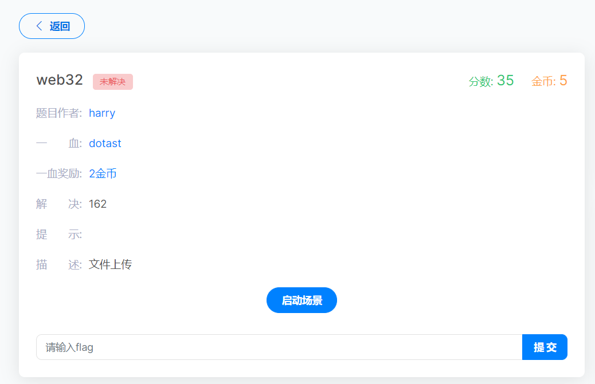
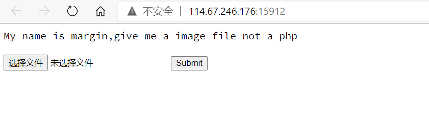
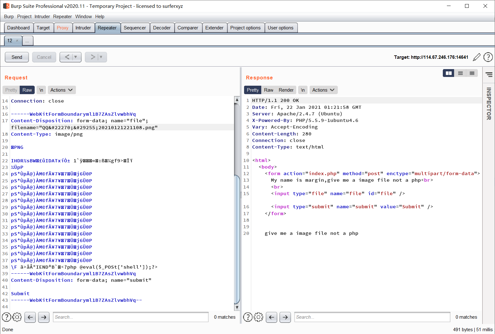
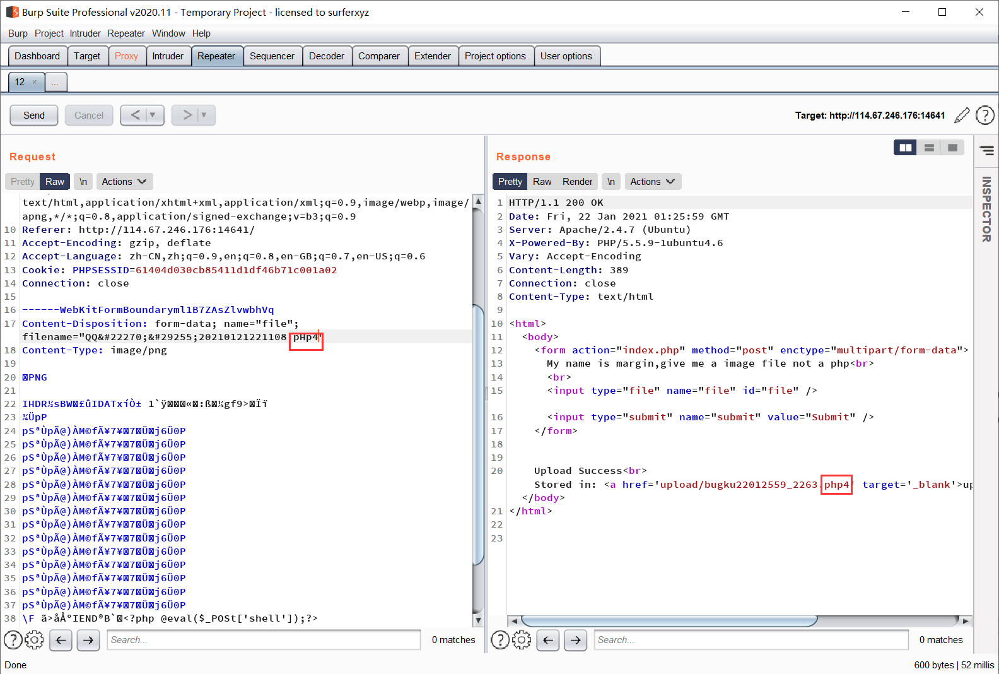
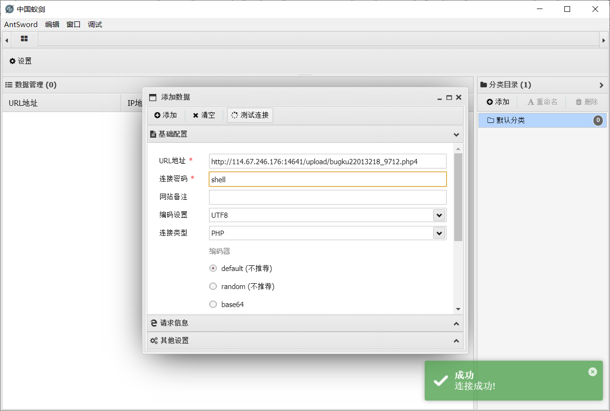
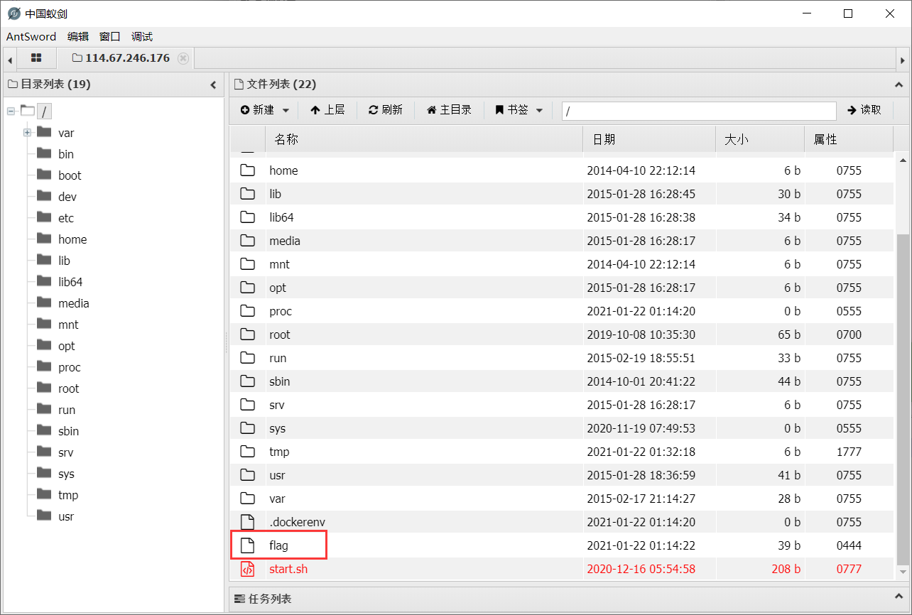

# web32

文件上传
进入题目

My name is margin,give me a image file not a php
我的名字是margin，给我一个图片，而不是php文件

上传图片马
没成功
换几个后缀名
php还有很多自带的后缀名
>php1、php2、php3、php4、php5、phtml、pht

也可尝试大小写绕过
>pHp1、Php2、PHp3、pHp4、PHP5、Phtml、Pht
也都没有成功
emmmmm

----
看了评论区之后晓得了请求头中有一个防护
>Content-Type: multipart/form-data
[Content-Type: multipart/form-data](https://blog.csdn.net/five3/article/details/7181521)
这个请求头是一种防护
把multipart/form-data改为大写
只要改一个字母就行(具体是啥原因我也不太清楚)
>我自己的理解是这个mutipart/form-data防护与后端有一个验证，
>然后把mutipart/form-data改为大写之后，与后端的验证不符合
就跳过了验证

经过测试
只有php4可以绕过，其他的都不行，而且后端也会吧大写给转换成小写

使用蚁剑连接

在根目录下找到flag

