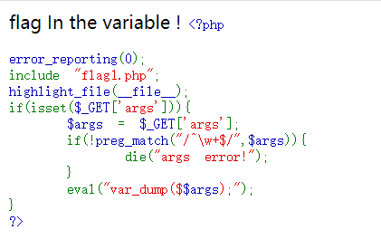
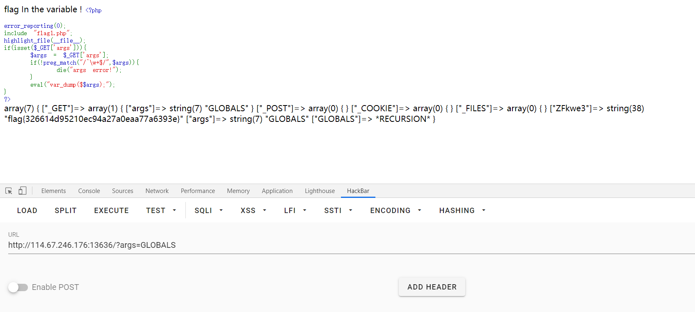
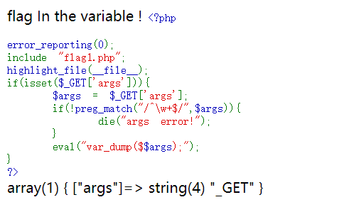
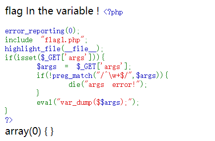
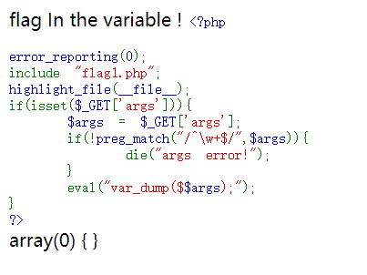
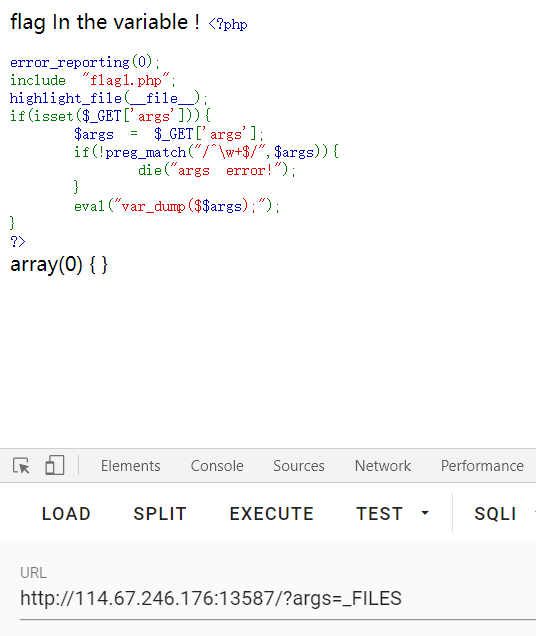

# web9

bugku出了一个新的平台

出了挺久了

做到web9才想起来要写笔记

所以就从web9开始写了

进入环境



一窜英文

翻译过来就是flag在变量里

error_reporting函数的意思是屏蔽所有php的报错信息

包含flag.php文件

highlight_file(/__file__)高亮文件代码

```php
<?php
if(isset($_GET['args'])){
    $args = $_GET['args'];
    if(!preg_match("/^/w+$",$args)){
        die("args error!");
    }
    eval("var_dump($$args);")
}
?>
```

代码大致意思是：

如果args的get请求不为空就$args等于args的get请求传过去的参数

再如果正则匹配如果传入的参数里有除了大小写字母以外的字符串，就打印args error的字符串

否则就执行打印$$args的相关信息。

此中的难点是$$args刚开始看的时候有点懵，查了一下有两个美元符的变量是可变变量

可变变量是php的一个特性

官方文档没有详情请[看这](https://blog.csdn.net/a757291228/article/details/57083568)

然后题目里说flag再变量里

然后这又是个可变变量

我太菜了，就使用了穷举法

把php所有的固定变量都试了一遍

然后全局变量就打印出了flag



补充：

​		这一题请教了一下老师，为什么用GLOBALS可以打印出flag

因为这一题已经给固定的几个变量设有sdfsdjalf了

_GET是args



_POST是空



_COOKIE是空



​	_FILES是空



ZFkwe3就是flag


如果是GLOBALS就会执行递归

就会把所有的变量给弄出来

