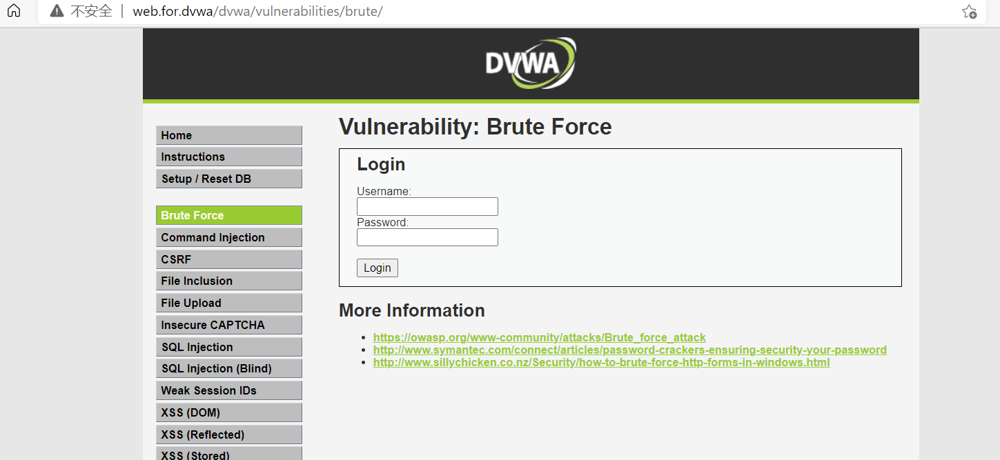
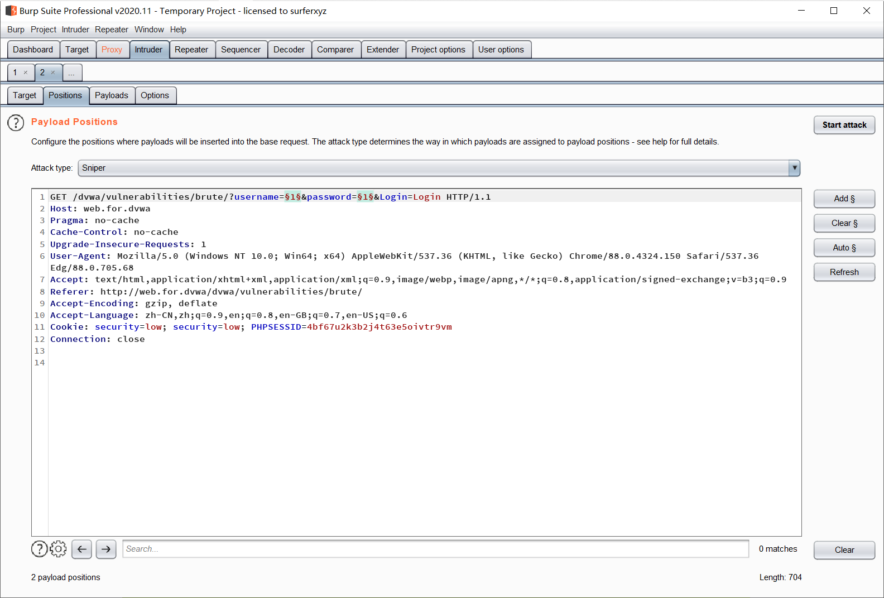
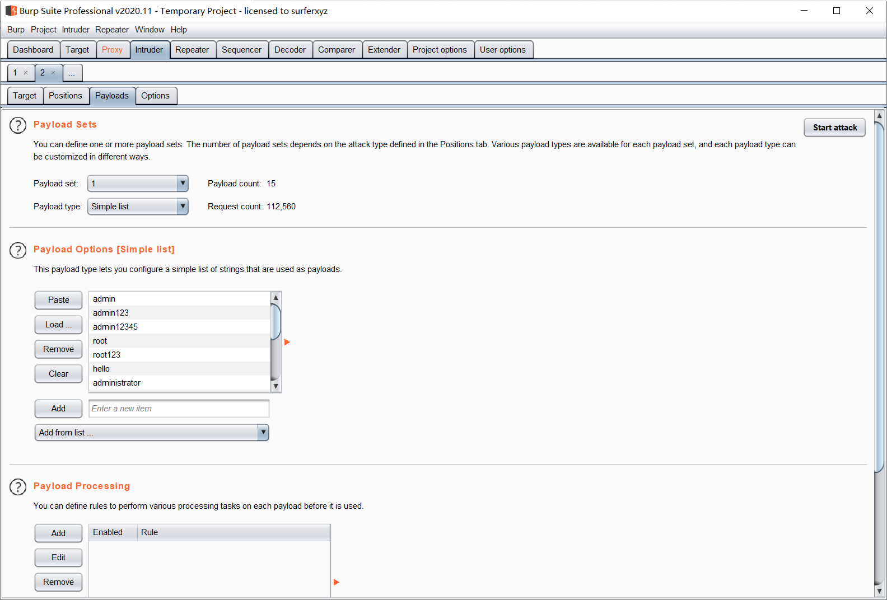
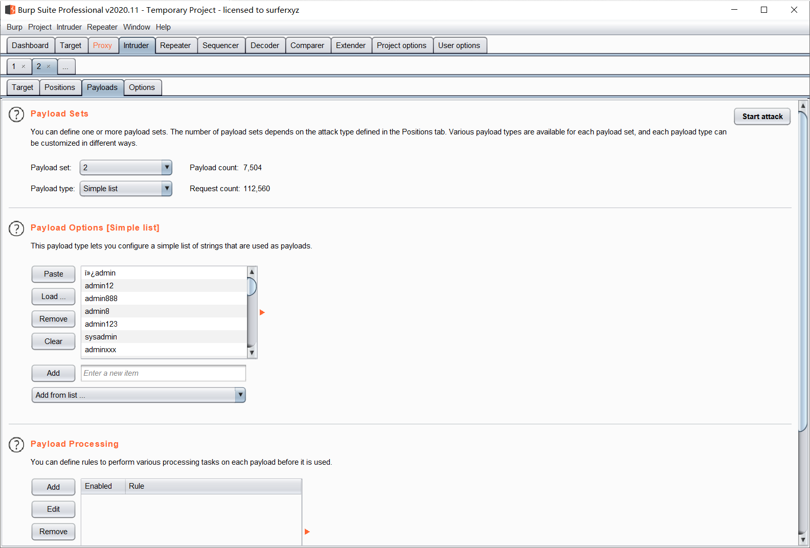
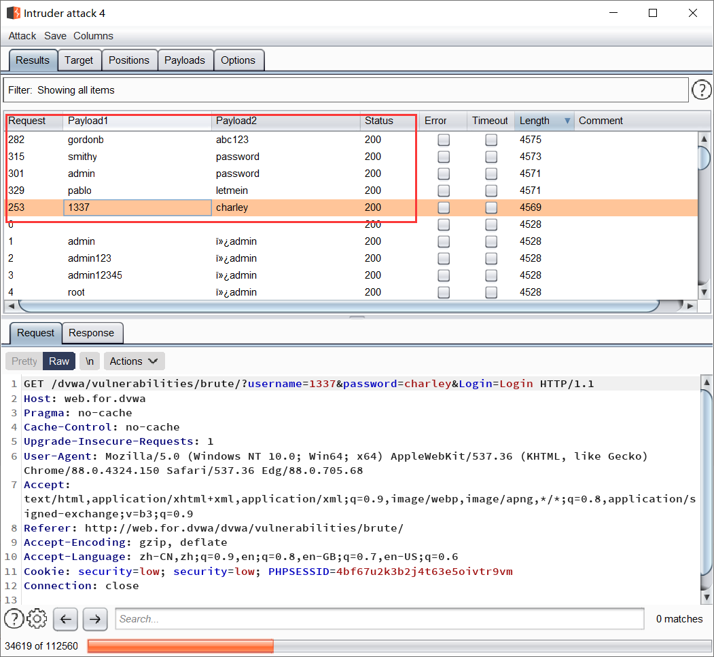

# LEVE LOW




源码

```php
<?php

if( isset( $_GET[ 'Login' ] ) ) {
    // Get username
    $user = $_GET[ 'username' ];

    // Get password
    $pass = $_GET[ 'password' ];
    $pass = md5( $pass );

    // Check the database
    $query  = "SELECT * FROM `users` WHERE user = '$user' AND password = '$pass';";
    $result = mysqli_query($GLOBALS["___mysqli_ston"],  $query ) or die( '<pre>' . ((is_object($GLOBALS["___mysqli_ston"])) ? mysqli_error($GLOBALS["___mysqli_ston"]) : (($___mysqli_res = mysqli_connect_error()) ? $___mysqli_res : false)) . '</pre>' );

    if( $result && mysqli_num_rows( $result ) == 1 ) {
        // Get users details
        $row    = mysqli_fetch_assoc( $result );
        $avatar = $row["avatar"];

        // Login successful
        echo "<p>Welcome to the password protected area {$user}</p>";
        echo "";
    }
    else {
        // Login failed
        echo "<pre><br />Username and/or password incorrect.</pre>";
    }

    ((is_null($___mysqli_res = mysqli_close($GLOBALS["___mysqli_ston"]))) ? false : $___mysqli_res);
}

?>
```

代码审计

> level low:
>
> ​	`if ( isset($_GET['Login']))` # 判断是否登录
>
> ​	`$user = $_GET[ 'username' ]` # 获取一个GET请求的username的值，赋值给$user
>
> ​	`$pass = $_GET[ 'password' ]` # 获取一个GET请求的password的值，赋值给pass
>
> ​	`$pass = md5( $pass )` # md5编码过后的$pass再赋值给$pass
>
> ​	`$query  = "SELECT * FROM `users` WHERE user = '$user' AND password = '$pass';"` # 构造sql语句，条件user赋予$user，条件password赋予$pass，构造完成之后就把语句赋值给$query
>
> ​	` $result = mysqli_query($GLOBALS["___mysqli_ston"],  $query ) or die( '<pre>' . ((is_object($GLOBALS["___mysqli_ston"])) ? mysqli_error($GLOBALS["___mysqli_ston"]) : (($___mysqli_res = mysqli_connect_error()) ? $___mysqli_res : false)) . '</pre>' )` # 使用mysqli_query函数去连接数据库并查询如果不成功就返回报错信息并结束程序，赋值给$result
>
> ​	`if( $result && mysqli_num_rows( $result ) == 1 )` # 再判断$result和mysqli_num_rows($result)是否等与1
>
> ​	`$row    = mysqli_fetch_assoc( $result )` # 如果等于1就把mysqli_fetch_assoc($result)关联获取到的数据赋值给$row
>
> ​	`$avatar = $row["avatar"]` # 把$row中的avatar赋值给$avatar
>
>  	`echo "<p>Welcome to the password protected area {$user}</p>"` # 打印
>
> ​	 `echo ""` # 打印
>
> ​	`echo "<pre><br />Username and/or password incorrect.</pre>"` # 打印

通过代码审计过后得知这里并没有进行任何防护

可以直接使用字典进行爆破

使用bp抓包添加变量



然后添加字典



添加第二个字典



然后开始...

run!


得到所有用户的用户名和密码~



结束！