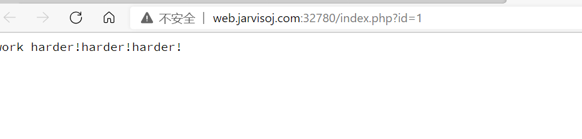
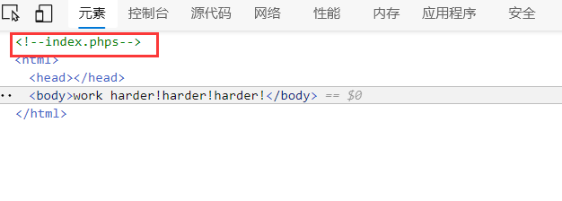
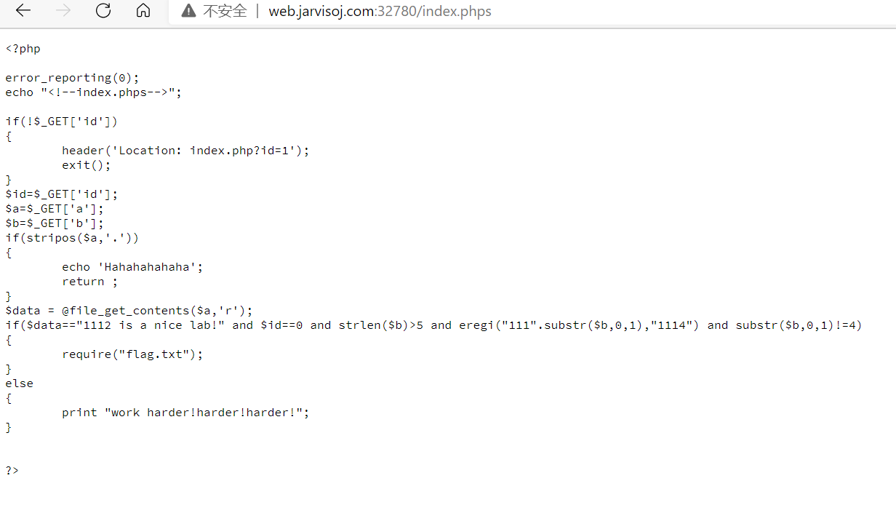

# IN A Mess

进入题目



> work hader!harder!hader!

努力努力！

惯例查看源码



看到有一个注释的页面

查看页面



得到源码

```php
<?php

error_reporting(0);
echo "<!--index.phps-->";

if(!$_GET['id'])
{
	header('Location: index.php?id=1');
	exit();
}
$id=$_GET['id'];
$a=$_GET['a'];
$b=$_GET['b'];
if(stripos($a,'.'))
{
	echo 'Hahahahahaha';
	return ;
}
$data = @file_get_contents($a,'r');
if($data=="1112 is a nice lab!" and $id==0 and strlen($b)>5 and eregi("111".substr($b,0,1),"1114") and substr($b,0,1)!=4)
{
	require("flag.txt");
}
else
{
	print "work harder!harder!harder!";
}


?>
```

代码审计

第一个判断`if(!$_GET['id'])`

这一句的意思是如果GET请求的不是id，就强制转跳到id=1的页面

第二个判断`if(stripos($a,'.'))`

这一个判断的意思是传入`$a`的值出现`.`就打印Hahahahahaha

这一句`$data = @file_get_contents($a,'r');`的意思是从`$a`读取字符串并读入文件，然后把值传入`$data`

第三个判断`if($data=="1112 is a nice lab!" and $id==0 and strlen($b)>5 and eregi("111".substr($b,0,1),"1114") and substr($b,0,1)!=4)`的意思是如果`$data`的值等于`1112 is a nice lab!`和`$id==0`和`$b`的值等于`0`和`$b`的值长度不大于5和正则匹配(不区分大小写)`111`连接的`$b`传入的值的第一位的字符后是否是`1114`，和`$b`传入的值不能是4

这个eregi正则函数是有截断漏洞的，可以