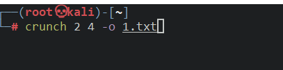

# crunch

crunch是一个爆破字典生成的工具，按照指定的规则生成密码字典，可以按照自己的想法去制作自己的字典

----

**参数**

* min设定最小的字符串长度(必填)
* max设定最大的字符串长度(必填)
* -o将生成的字典保存在指定的文件中
* -t指定密码输出的格式
* -p指定元素组合

**特殊字符**

* % 代表数字
*  ^ 代表特殊符号
* @ 代表小写字母
* , 代表大写字母

**例子**:

> 2是最小字符串长度
>
> 4是最大字符串长度
>
> -o指定保存到1.txt文件里