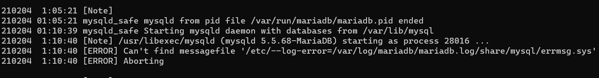
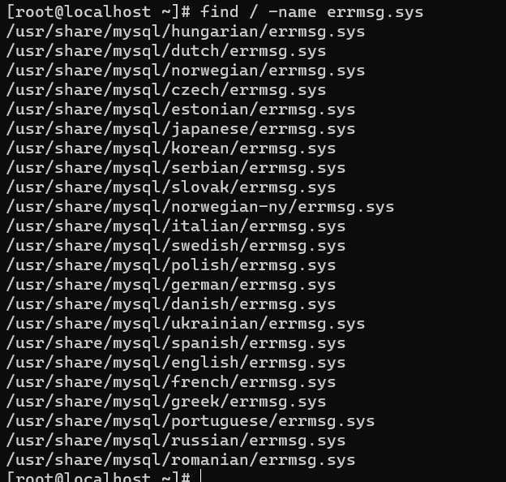
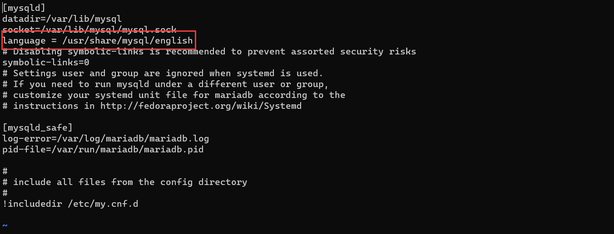
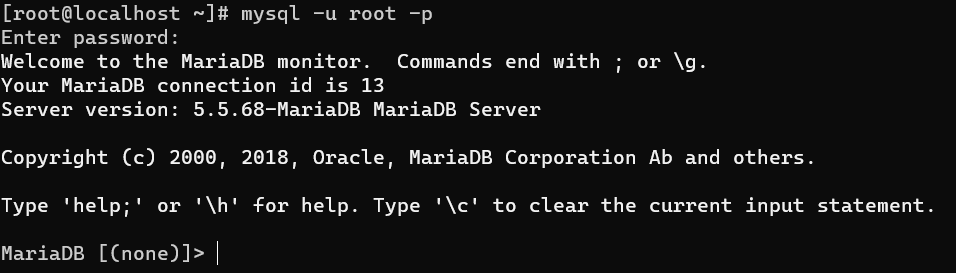

# mariadb折腾记录


**在linux deploy的centos7中，安装的是aarch64cpu版本**

**因为linux deploy使用的是[chroot容器技术]([chroot_百度百科 (baidu.com)](https://baike.baidu.com/item/chroot/3267609))所以呢，在这里的centos7无法使用systemctl和service指令**

**所以需要找一个替代品**

**那就是**[`servicectl`]([smaknsk/servicectl: Control services (daemons) for systemd in chroot environment (github.com)](https://github.com/smaknsk/servicectl/))

```shell
wget https://github.com/smaknsk/servicectl/archive/1.0.tar.gz
tar -xf 1.0.tar.gz -C /usr/local/lib/
ln -s /usr/local/lib/servicectl-1.0/servicectl /usr/local/bin/servicectl
ln -s /usr/local/lib/servicectl-1.0/serviced /usr/local/bin/serviced
```

**安装完成后就可以使用了**

**一切看起来都还行**

**不过mariadb就不太乐意了就站了出来**

**启动失败！XD**

**查看日志**



```shell
210204  1:11:20 [ERROR] Can't find messagefile '/usr/local/mysql/share/english/errmsg.sys'
210204  1:11:20 [ERROR] Aborting
```

**在百度必应谷歌了几个小时之后终于知道了问题所在**

**因为在这个yum的源里打包的mariadb包是二进制包，已经编译好了的**

**所以会因为环境的不同而会报错**

**这里找不到errmsg.sys这个文件**

**所以使用**`find / -name errmsg.sys` **去查看这个文件现在在哪个地方**



**找到了众多语言的**`errmsg.sys` **使用english的就好**

**把路径复制下来，然后到** `my.cnf` **这个文件里添加**

```shell
language = /user/share/mysql/english
```




**就可以了**

**因为安卓手机默认是没有mysql或者mariadb服务的**

**所以要把mysql添加到手机的群组里**

```shell
usermod -a -G aid_inet,aid_net_raw
```

**这样就可以启动成功了**




 