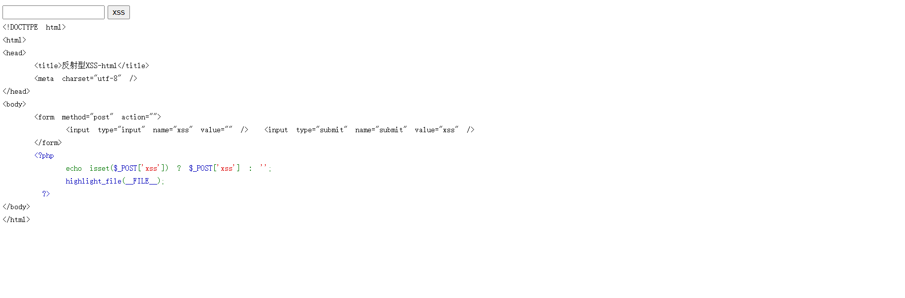
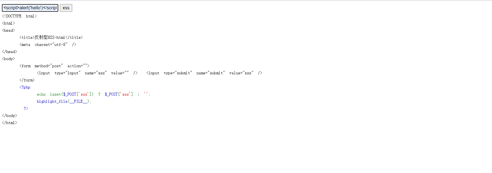
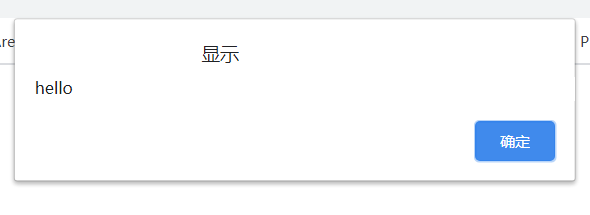

# 安恒信息第一期培训作业

# XSS1篇

进入实验地址



有一段php代码回显这段php代码的基本意思是打印post请求的参数

如果是空的就打印空

这里使用了三目运算法

三目运算可以说是if条件的另一种写法

```php
<?php
    isset($_POST['xss']) ? $_POST['xss'] : '';
?>
```

> 这一句可以表达的意思是这样的

```php
<?php
    if (isset($_POST['xss'])){
        echo $_POST;
    }else {
        echo '';
    };
```

不过这一段在xss这里没啥作用

我的看法是用来模糊想法的

这一题没做任何过滤防护

可以直接执行js语句



