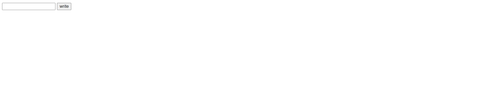
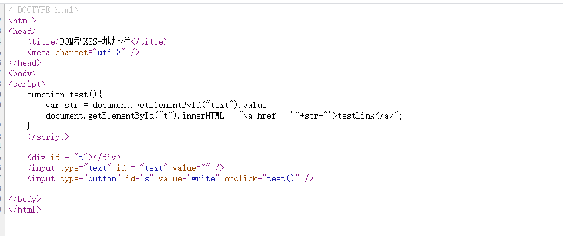
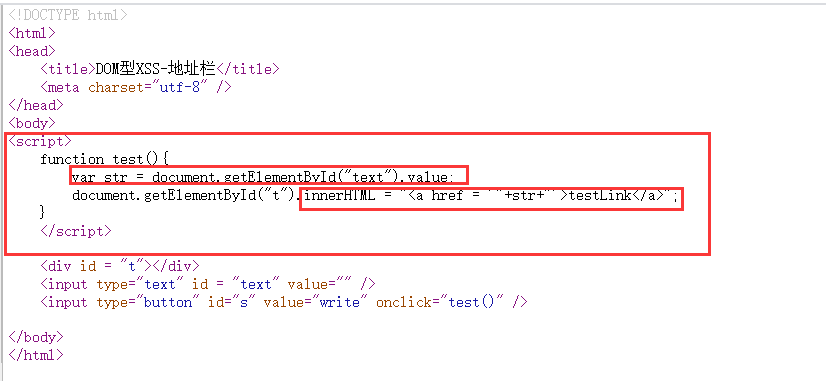
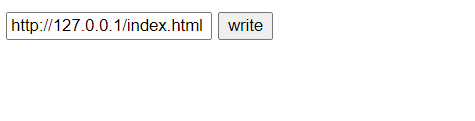
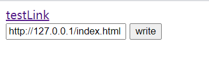
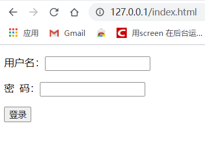

# 安恒信息第一期培训作业

# xss2篇

进入实验地址

只有一个post提交页面

按看一下源码

这里是把post表单传的参数做成超链接

这就是一个xss的跨站漏洞了

可以提交一个自己做的页面作为参数

然后提交

得到超链接

然后点击超链接

就进入到自己做的网页了

跨站xss漏洞的危害很大

制作一些钓鱼网站

然后通过跨站xss漏洞

使用户进入到钓鱼网站然后获取用户的信息

进行伪造就可以得到用户的权限了