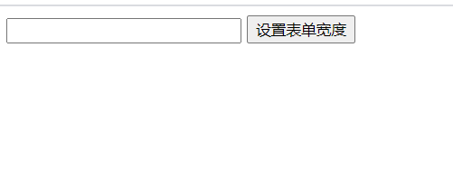
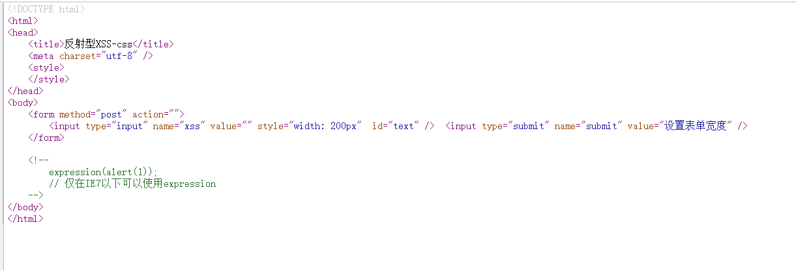
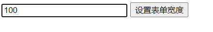
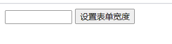
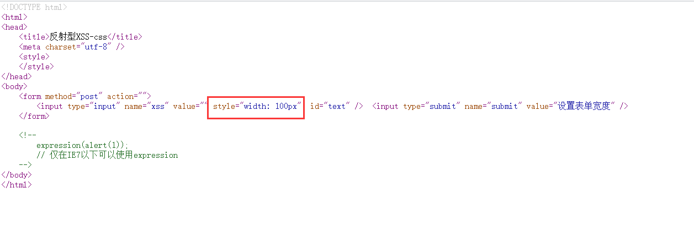
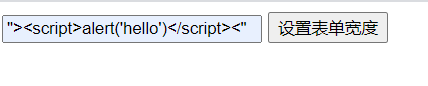

# 安恒信息第一期培训作业

# XSS6篇

进入实验



这个post框输入的数字可以改变post框的大小









它后台的js代码盲猜是

```js
var str = documet.getElementById('text').value
```

然后把这个变量传递到设置表单的宽度上

嘿嘿

继续使用前两关的payload试试

```js
"><script>alert('hello')</script><"
```




芜湖~~

一样可以使用，屡试不爽

