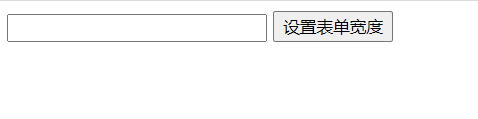
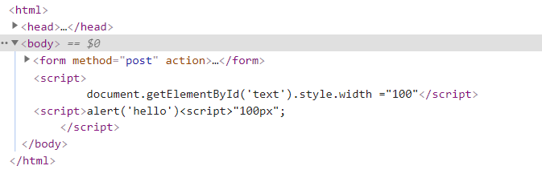

# 安恒信息第一期培训作业

# XSS7篇

进入实验




查看源码，发现它直接使用getElmentById来接收text的变量，来改变post框的宽度了

因为执行的语句是getElmentByld了，所以之前的payload无法使用了

虽然"><"去闭合的套路无法使用了，但是可以使用/<srcipt>的闭合标签去闭合它前面的script标签

payload就是

```js
100"</script><script>alert('hello')<script>"100
```


 