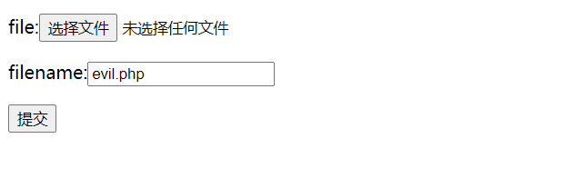
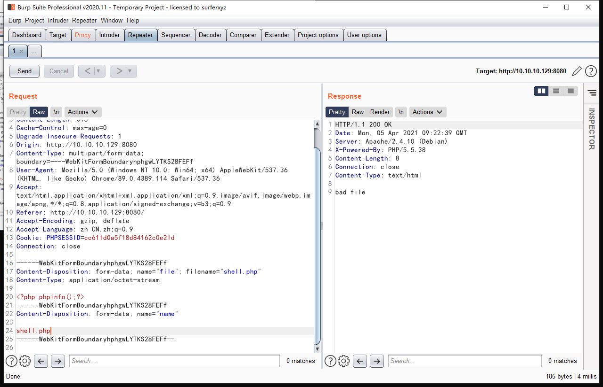
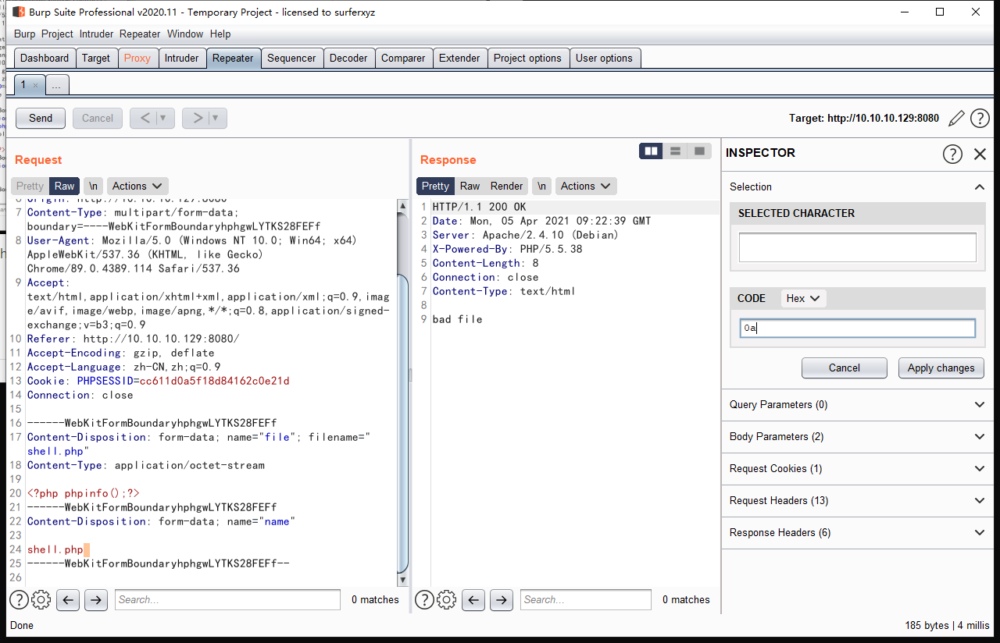
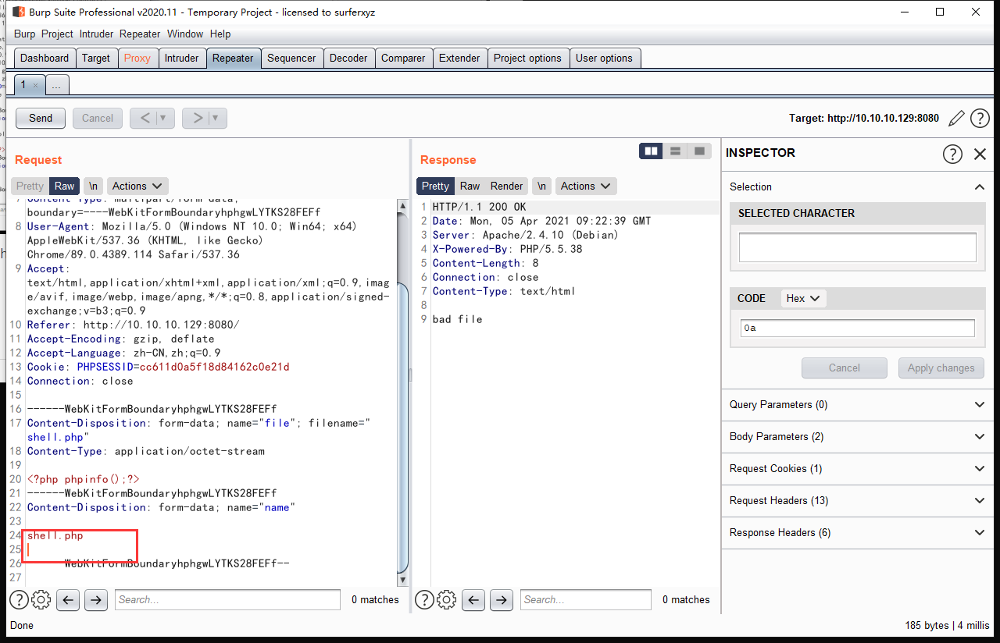
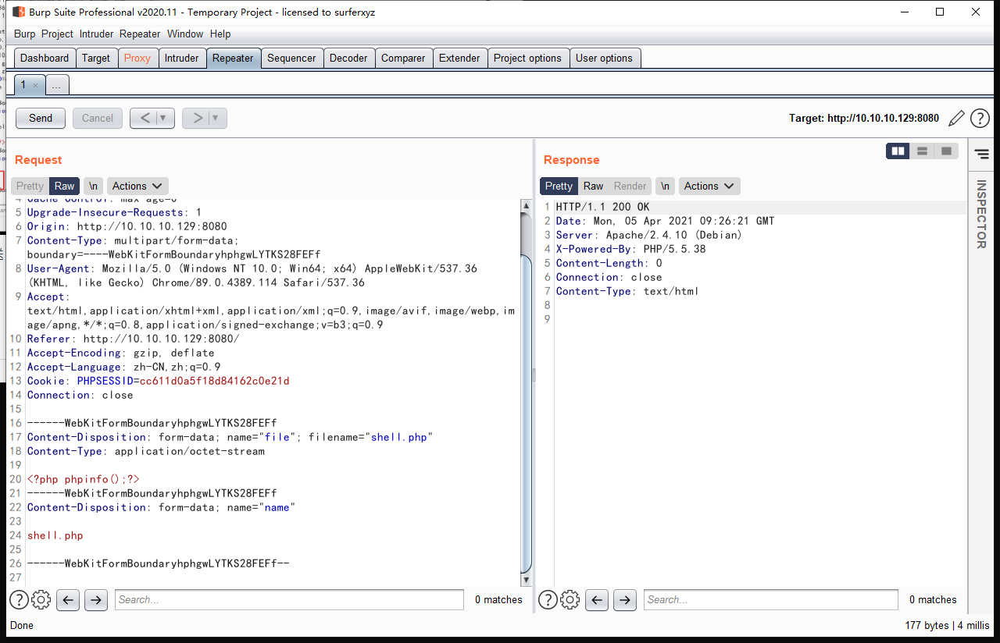
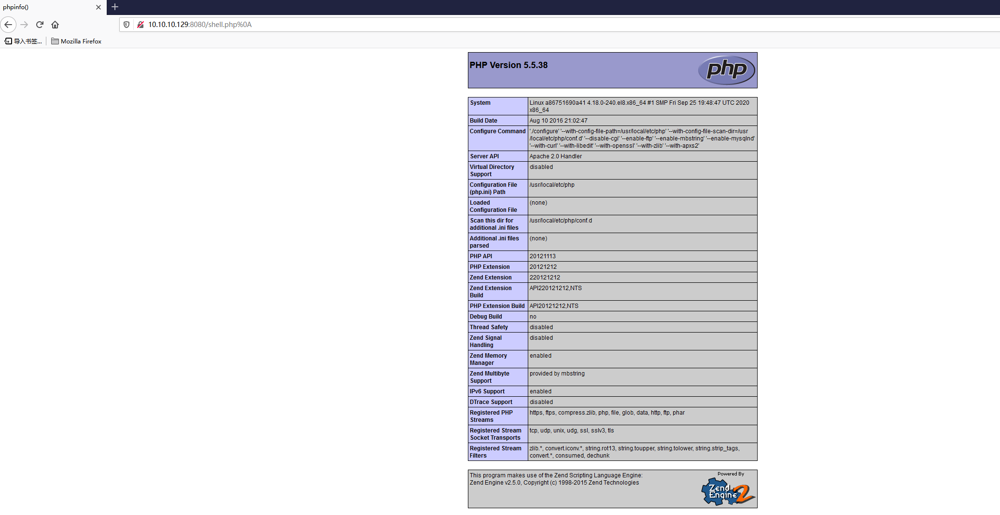

# httpd换行符解析漏洞

启动环境

> `docker-compose build`
>
> `docker-compose up -d`
>
> 进入环境**自己ip的8080端口**

上传一个webshell

直接上传会失败

在burpsuite的2020版之后删除了hex模块，添加了可以直接输入hex编辑器

把这个空格的hex值换成0a换行的hex值

然后点applychanges就可以了

然后send发送

发送成功

然后去验证

得到解析后的php网页