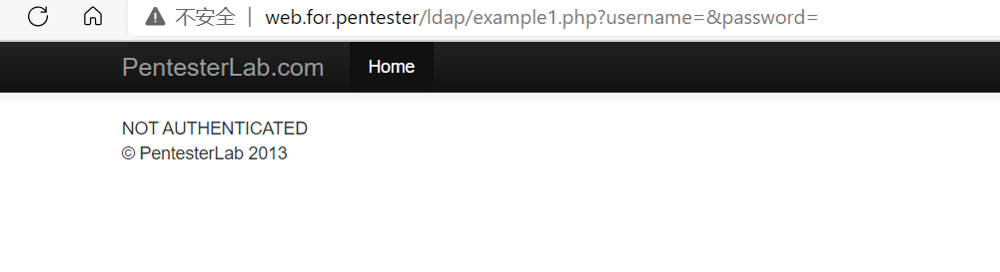
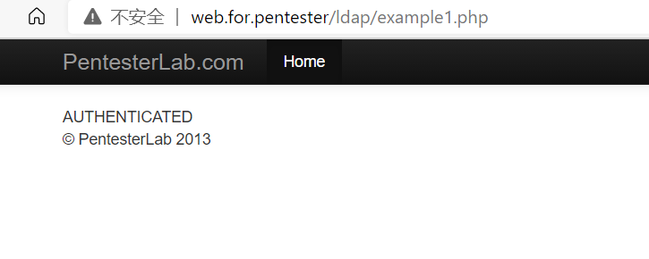

# LDAP漏洞

​		LDAP(Lightweight Directory Access Protocol):轻量级目录访问协议，是一种在线目录访问协议，主要用于目录中资源的搜索和查询，是[X.500](https://baike.baidu.com/item/X.500/8863300)的一种简便的实现。

通俗的说就是，LDAP是用于访问在线目录的服务(特别是基于X.500协议的目录服务)的轻量级客户端服务器协议，它通过TCP/IP传输服务运行。关键的地方在于，数据是存储再目录中，而不是存储再数据库中。目录和数据库有很多共同之处，都可以存储数据，并能再一定程度进行搜索和查询。它们的区别就在于目录适合存放静态数据，它存储的数据无论字类型和种类比数据库中的数据都要更为繁多，包括音频、视频、可执行文件、文本等文件，另外目录中还存在目录的递归。既然是存放不同类型的静态数据，那么目录服务在进行优化后更佳适于读的访问，写与修改的操作就不适合

### LDAP的攻击原理

LDAP的攻击手法和sql注入的原理非常相似，在漏洞的环境中，这些查询参数没有得到合适的过滤，因而攻击者可以注入任意的恶意代码。这里使用web for pentester的实验环境进行复现

进入example1.php

源码

```php
<?php
  require "../header.php" ;
  $ld = ldap_connect("localhost") or die("Could not connect to LDAP server");
  ldap_set_option($ld, LDAP_OPT_PROTOCOL_VERSION, 3);
  ldap_set_option($ld, LDAP_OPT_REFERRALS, 0);
  if ($ld) {
   if (isset($_GET["username"])) {
     $user = "uid=".$_GET["username"]."ou=people,dc=pentesterlab,dc=com";
   }
   $lb = @ldap_bind($ld, $user,$_GET["password"]);

    if ($lb) {
       echo "AUTHENTICATED";
    }
    else {
       echo "NOT AUTHENTICATED";
    }
  }
  require "../footer.php" ;
?>
```

进行代码审计

1. `$ld=ldap_connect("localhost") or die("Could not connect to LDAP server")`

   > 这一句是连接ldap服务，如果连接不成功就退出程序并打印Could not connect to LDAP server

2. `ldap_set_option($ld, LDAP_OPT_PROTOCOL_VERSION, 3);`

   > 这一句是设定的预选值，LDAP_OPT_PROTOCOL_VERSION是设定的ldap的服务版本，设置为版本3

3. `ldap_set_option($ld, LDAP_OPT_REFERRALS, 0);`

   > LDAP_OPT_REFERRALS是设定是否返回LDAP的引用，设置为0，1是TRUE，0是FALSE

4. 然后开始判断$ld是否为真，如果为真就开始执行里面的程序

5. 再判断是否接收了一个$_GET请求的username

6. 变量$user设定值为`"uid=".$_GET["username"]."ou=people,dc=pentesterlab,dc=com"`

   > 这是进行username的验证

7. 然后变量$lb就开始ldap_bind进行使用ldap服务，$user的用户，还有接收一个passworde的get请求来绑定$user的目录

8. 再接着判断变量$lb为真就打印连接成功,否则就打印连接不成功


这里的验证，没有什么过滤，直接尝试验证绑定

payloay1

> example1.php?username=&password=



验证失败

ldap还有一个空验证

就是提交两个参数

ldap服务器就会绑定两个空的连接，认为它们是一样的

返回给php

php代码就会认为是真的，就开始继续执行

payload2

> example1.php



验证成功!

过关咯~~


