# include1

进入example1.php

源码
```php
<?php

        if ($_GET["page"]) {
                include($_GET["page"]);

        }


?>
```
这个文件包含没有做任何的过滤
可以直接包含任意文件(只要权限够)

这样的话可以做很多的操作
如果php的配置选项中**allow url include**为ON的话可以执行远程包含
可以通过include的特性去执行其他文件里的php代码
可以通过php伪协议来进行，获取源码，getshell，写入文件，获取其他文件的信息

## 1.远程包含

可以包含百度的robots.txt
>https://www.baidu.com/robots.txt
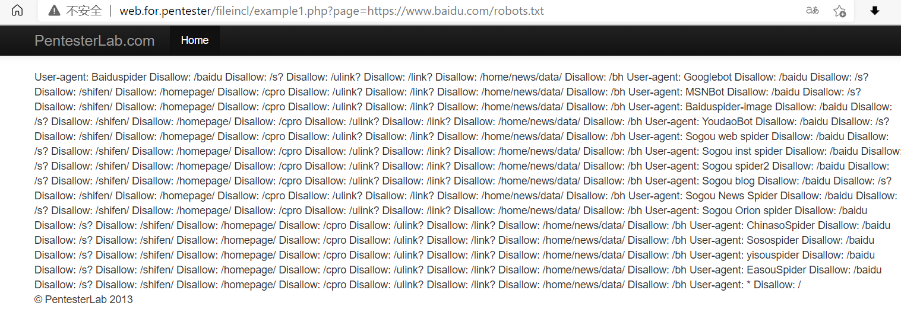


可以包含自己编写的网站
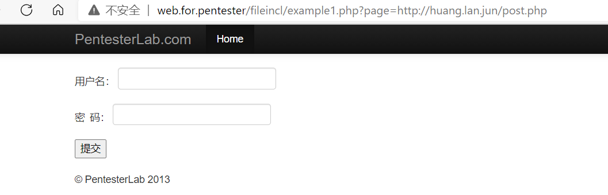
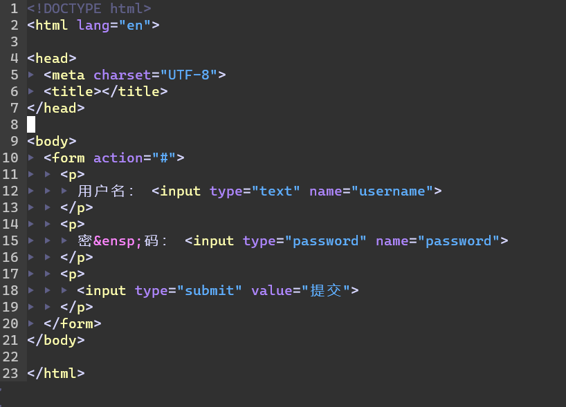

## 2.执行本地的其他文件

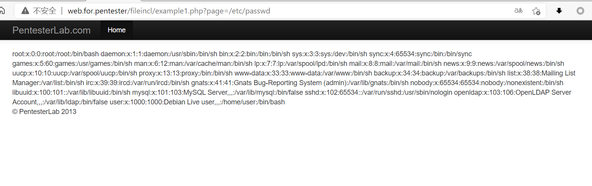

## 3.通过php伪协议进行获取源码，getshell, 写入文件

通过php://filter来查看文件的源码
>php://filter/read=convert.base64-encode/resource=example1.php

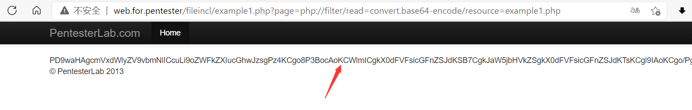
这样就获得了base64编码过后的源码
进行解码
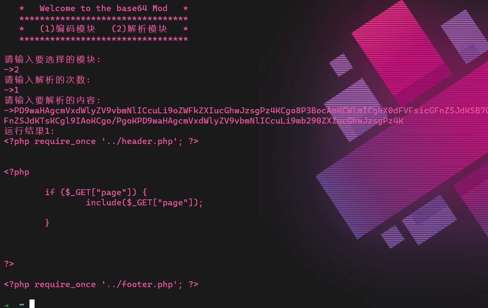
也可以查看其他的文件的
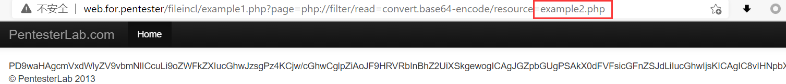
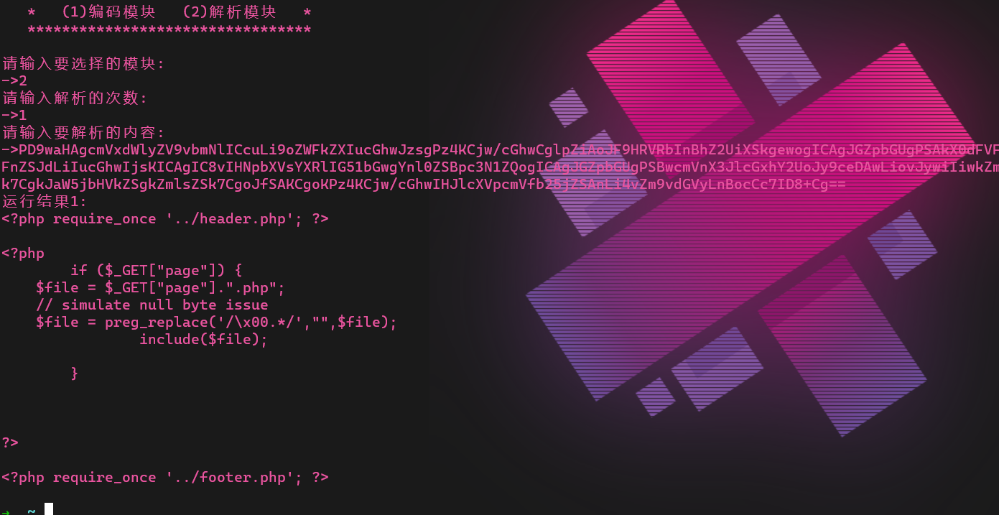

还可以通过加上file协议查看file协议看不了的文件
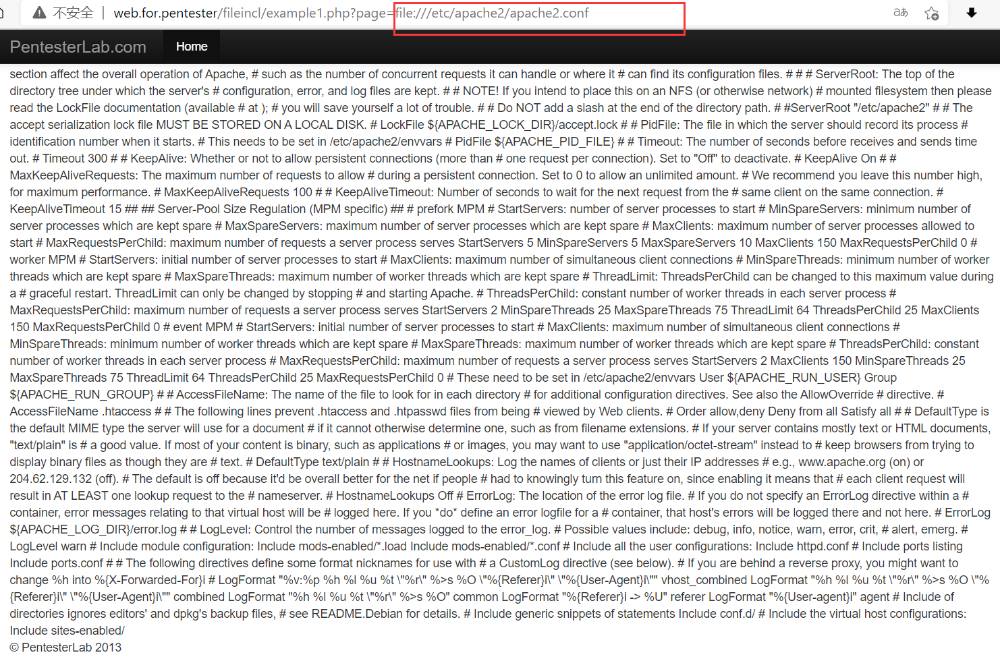
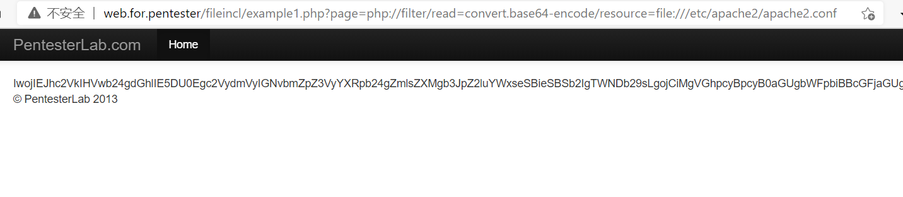
解码
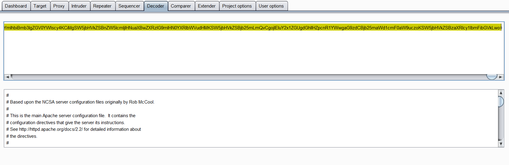

还可以通过data协议来进行执行php代码，写入一句话木马
**执行php代码**
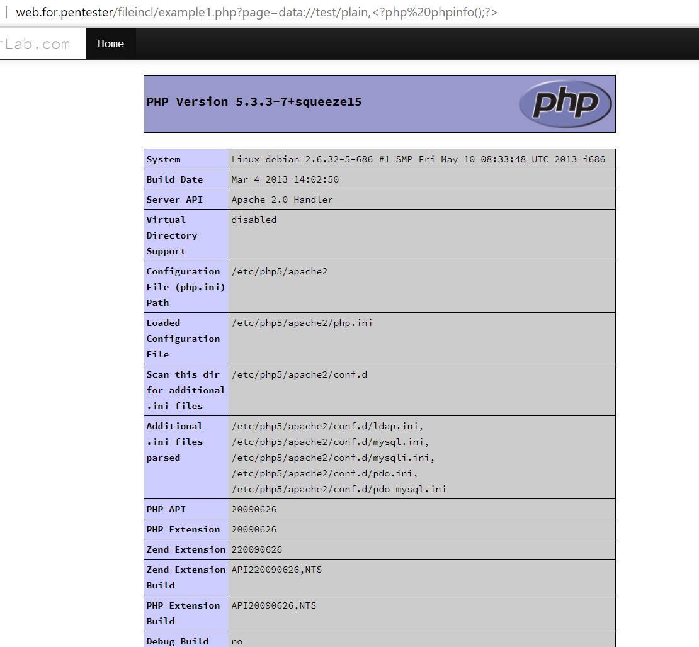
**写入一句话木马**
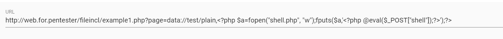
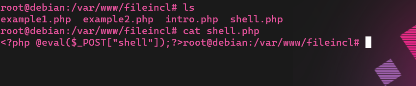
蚁剑连接
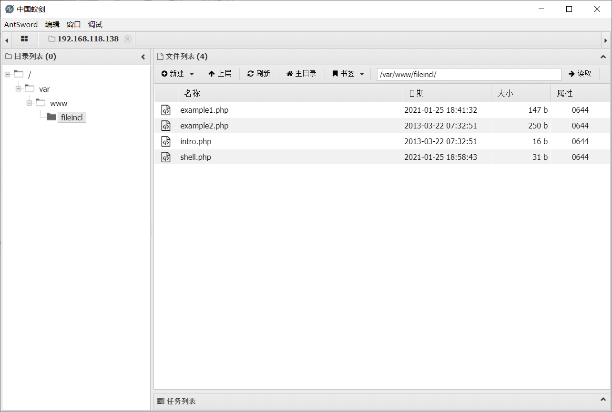

还可以使用php://input来执行php代码和写入一句话木马
**执行php代码**
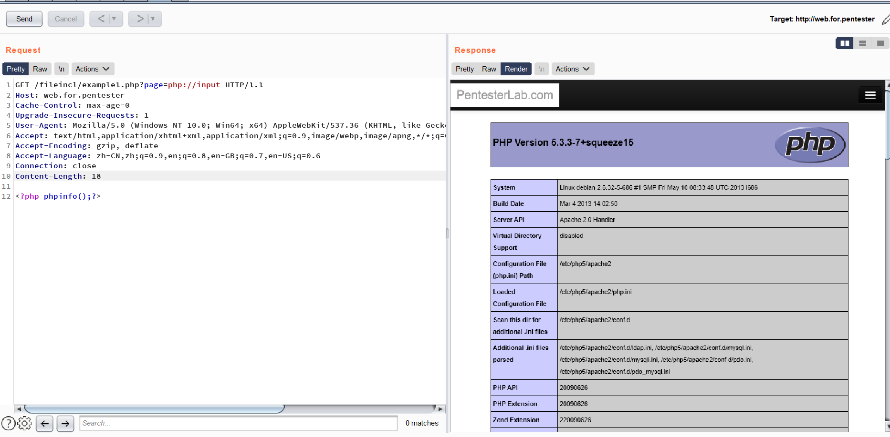

**写入一句话木马**
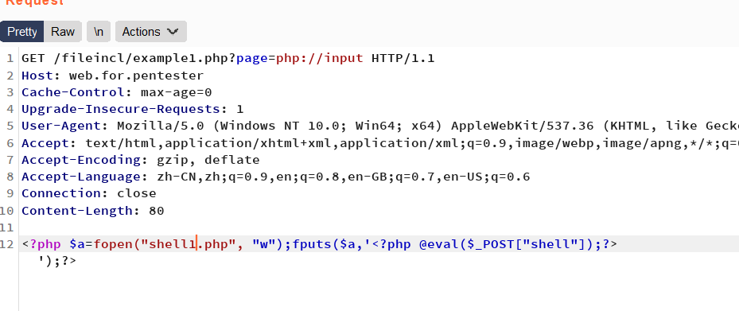
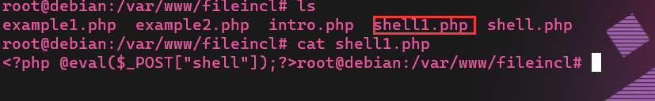

蚁剑连接
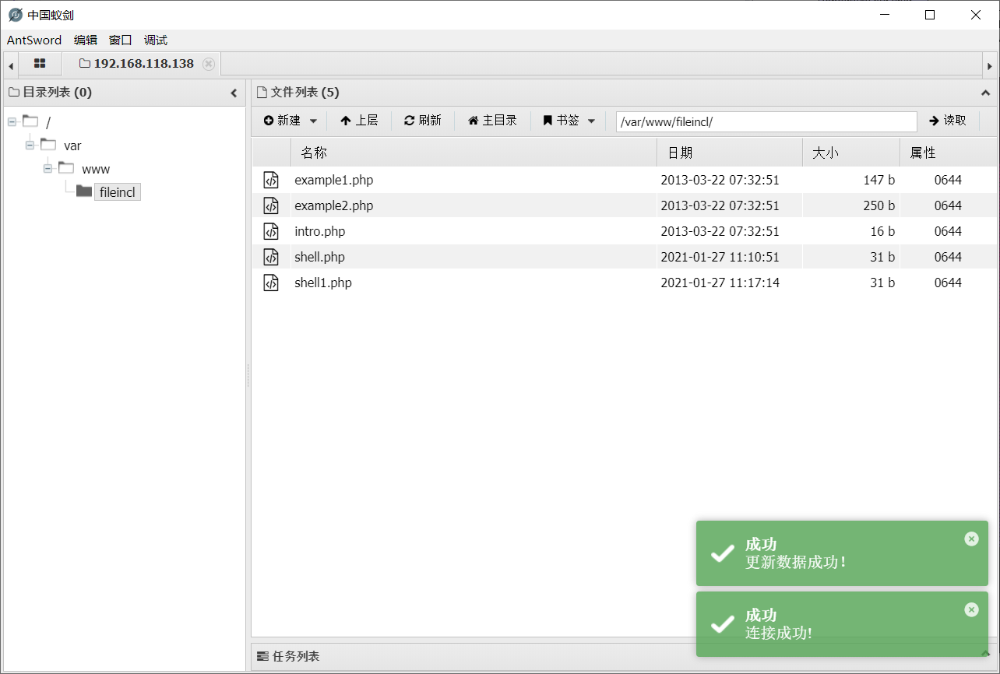

这些就是可以利用的啦
过关~~~~~
