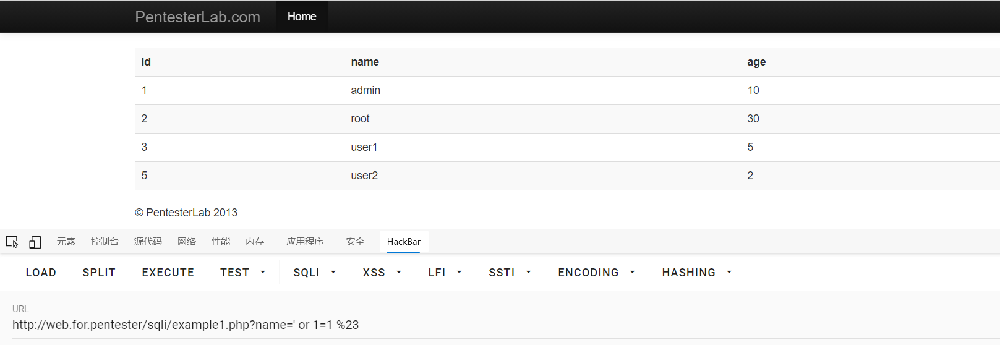

# sql1

进入example1.php

源码
```php
<?php

  require_once('../header.php');
  require_once('db.php');
        $sql = "SELECT * FROM users where name='";
        $sql .= $_GET["name"]."'";
        $result = mysql_query($sql);
        if ($result) {
                ?>
                <table class='table table-striped'>
      <tr><th>id</th><th>name</th><th>age</th></tr>
                <?php
                while ($row = mysql_fetch_assoc($result)) {
                        echo "<tr>";
                        echo "<td>".$row['id']."</td>";
                        echo "<td>".$row['name']."</td>";
                        echo "<td>".$row['age']."</td>";
                        echo "</tr>";
                }
                echo "</table>";
        }
  require_once '../footer.php';
?>
```
可以看出
没有任何的过滤
可以直接执行万能密码


| 请求方式 | 过滤方式 | 注入方式 | 闭合方式 |
| -------- | -------- | -------- | -------- |
| GET      | 无       | 万能密码 | 单引号'  |

拿到数据
过关~
下一关！
