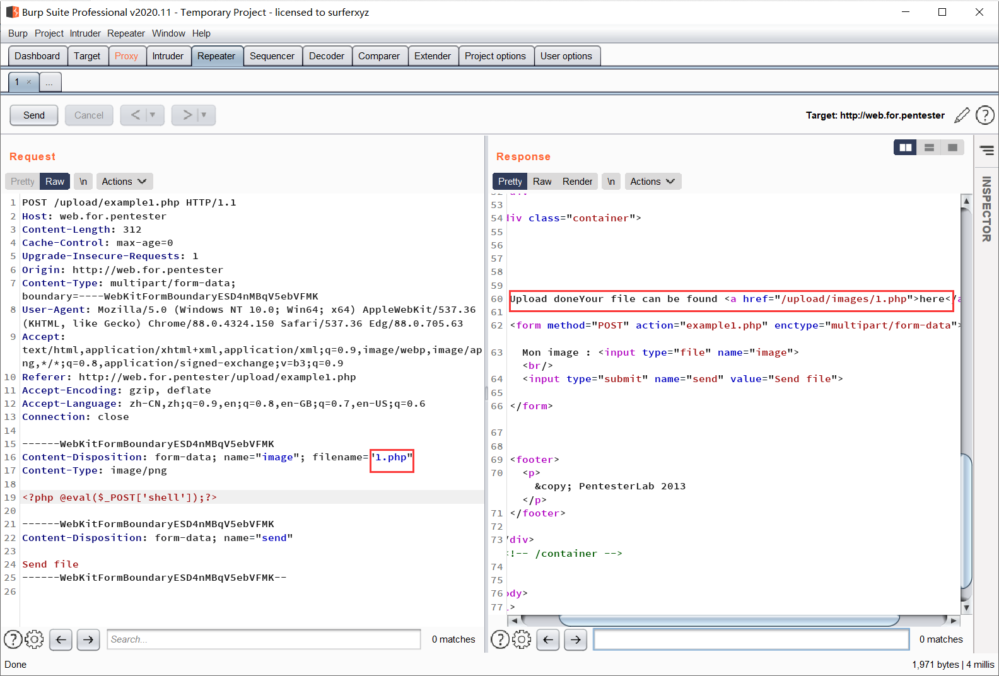
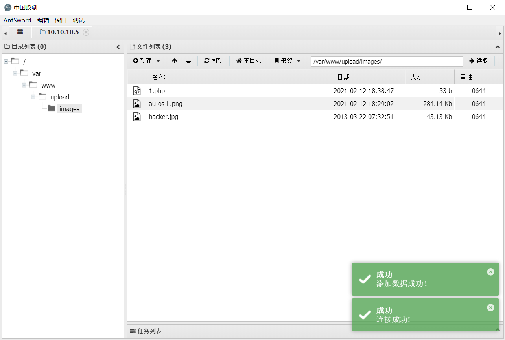

# upload

进入example1.php

源码

```php
<?php
if(isset($_FILES['image']))
{
  $dir = '/var/www/upload/images/';
  $file = basename($_FILES['image']['name']);
  if(move_uploaded_file($_FILES['image']['tmp_name'], $dir. $file))
  {
  echo "Upload done";
  echo "Your file can be found <a href=/"/upload/images/".htmlentities($file)."/">here</a>";
  }
  else
  {
        echo 'Upload failed';
  }
}
?>
```

代码审计

基本上没什么过滤

可以直接上传php文件



得到路径

使用蚁剑连接



得到shell