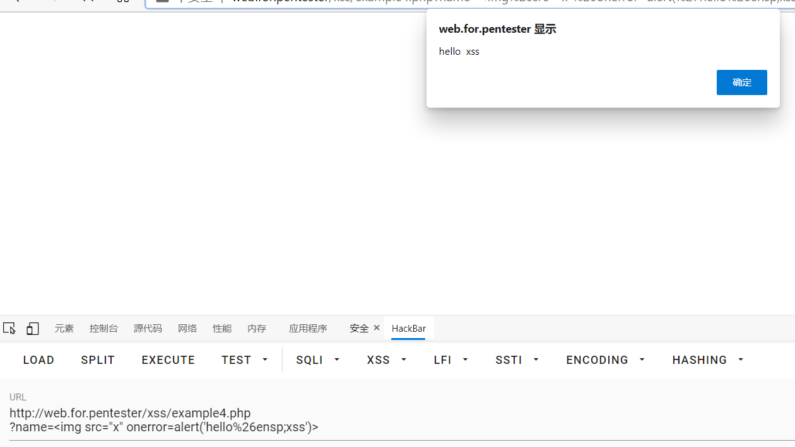
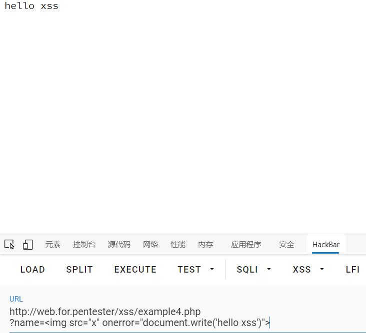

# xss4

进入example4.php

查看源码
```php
<?php
    if (preg_match('/script/i', $_GET['name'])){
        die("error");
}
?>
<?php 
    echo $_GET['name'];
?>
```

这一次直接使用正则去匹配script，如果传入的值里有script的话就直接结束程序然后打印一个error
所以这里不能使用嵌套还有大小写进行绕过了
这里就要说一下javascript的onerror事件了
当一个图片在加载过程中出现错误无法加载时
就会执行javascript的代码

```javascript
example4.php?name=
```
>**注意：
    这有个坑，如果onerror等号后面跟的参数没有加双引号的话就会就不能在字符串里加空格否则就无法执行
    因为如果onerror等号后面的参数如果不加双引号的话，就会被解析器判断为html代码去执行而不是被onerror执行
    因为是html代码所以空格号的url编码是%00，这个编码是会截断后面的代码，然后就会报错无法执行这一段代码
    比如说alert('helloxss')是一段代码，加了空格之后alert('hello xss')传参过去之后空格就会被浏览器转码成%00，然后就被截断成了
    alert('hello这样的代码，所以就会报错语法不正确
    不过想要使用空格的话呢就需要使用html的实体编码去代替空格%26ensp;(%26是url编码的&)这样就可以执行了**



payload2
```javasecript
example4.php?name=
```

 过关啦\~\(\^_^)~ ~啦啦啦啦~~