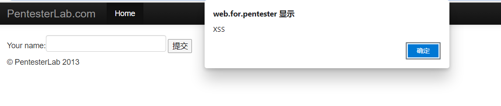

# xss8

进入example8.php

源码
```php
<?php
    if (isset($_POST['name'])){
        echo "HELLO".htmlentities($_POST['name']);
}
?>
<form action="<?php echo $_SEVER['PHP_SELF'];?>" method="POST">
    Your name:<input type='text' name='name'/>
    <input type='submit' name='submit'>
```
这里使用了相对安全的POST请求
这题也是闭合题
主要是这个`<?php echo $_SEVER['PHP_SELF'];?>`这一句
这个是可以自己控制的
在url栏输入什么都会进入到form表单的action这里

随便输入各一个字符串


就会进入到了这里
所以而且这里还不受到POST请求的html实体编码的转换
所以可以在这里进行对form表单的闭合然会执行js代码

这里也可以插入一些form表单的事件进行xss注入
可以使用onclick
payload2
```html
" onclick="alert('hello xss')""
```
上传参数之后
form表单就变成了这样

然后点提交就会弹窗



过关！！！！！